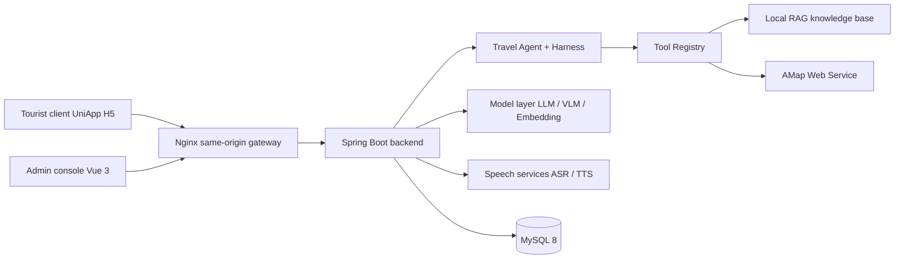

# LvLing AI Travel Agent

> A multi-city AI travel digital employee, forked and extended from Guido

[简体中文](README.md) | **English** | [日本語](README.ja.md) | [한국어](README.ko.md)

## Overview

LvLing turns scattered scenic-area material, live POI / weather / routing capabilities, and large-model generation into one traceable AI travel digital employee. The current version is built as an incremental `Travel Agent + Harness + Tool Calling + Provider + CityContext + RAG + Digital Human` architecture, and ships three parts: a UniApp Web/H5 tourist client, a Vue 3 admin console, and a Spring Boot backend.

- **For tourists:** converts scenic material into traceable Q&A, supports text, voice, and photo input, and recommends routes based on interests.
- **For operators:** centrally maintains scenic areas, spots, routes, knowledge documents, model configuration, and digital-human avatars, with dashboards covering frequent questions, popular spots, and visitor sentiment.
- **For engineering:** isolates vendor differences behind a protocol adaptation layer, and keeps the core path maintainable, degradable, and debuggable through local knowledge retrieval, SSE streaming, credential encryption, and call logging.

Production runs on same-origin HTTPS: the browser loads the static H5 bundle, `/api` is reverse-proxied to the backend, and third-party service keys live only in server-side environment variables or encrypted configuration.

## Key Features

| Module | Highlights |
| --- | --- |
| Multimodal guidance | Text Q&A, voice Q&A, photo-based landmark recognition, contextual sessions, and source citations |
| Travel Agent | Intent extraction, task planning, harness execution, tool registry dispatch, result validation, and ExecutionTrace |
| Dynamic city | Resolves `CityContext` from a city name or browser geolocation, covering local cities and AMap dynamic discovery |
| AMap capabilities | Geocoding, POI, weather, walking routes, real coordinates, and map polylines |
| Local RAG | Document management, overlapping chunking, embedding, Top-K retrieval, keyword fallback, and retrieval testing |
| Streaming | SSE deltas, recognition results, cited sources, sentiment, audio URLs, and per-stage latency |
| Personalized routes | Interest-tag matching, weighted route ranking, estimated duration, recommendation reasons, and spot ordering |
| Digital guide | Avatar selection, voice and speed configuration, TTS playback, and Canvas state animation |
| AI service management | LLM, VLM, Embedding, ASR, and TTS configuration, capability tests, and default-service switching |
| Operations analytics | Top questions, top spots, sentiment distribution, knowledge hit rate, latency trends, and Word reports |
| Admin console | Management for scenic areas, spots, routes, knowledge base, tourists, feedback, sessions, logs, and dashboards |

> External capabilities such as LLM, ASR, TTS, and AMap Web Service require a configured provider in the deployment environment or the admin console. When configuration is missing, the system reports an explicit unavailable state instead of masquerading mock data as real results.

## Architecture



## Tech Stack

| Area | Technology |
| --- | --- |
| Backend | Java 17, Spring Boot 3.2.5, Maven |
| Data access | MyBatis-Plus 3.5.5, MySQL 8, Redis |
| API and auth | RESTful API, SSE, Sa-Token 1.38.0, Bean Validation |
| AI capabilities | OpenAI-Compatible, Anthropic-Compatible, Embedding, VLM, local RAG |
| Speech | Alibaba Cloud ASR, Alibaba Cloud TTS |
| Backend tooling | Spring AOP, BCrypt, AES-GCM, Knife4j 4.5.0, Hutool |
| Admin console | Vue 3.4, TypeScript 5.4, Vite 5.2, Element Plus 2.7, Pinia, ECharts 5.5 |
| Tourist client | UniApp, Vue 3.4, TypeScript, Three.js, Fetch Stream / SSE |

## Project Structure

```text
Guido-main/
├── backend/                        Spring Boot 3 backend service
│   └── src/main/java/com/guido/scenicai/
│       ├── agent/                  Travel Agent: intent, planning, harness, skills
│       ├── tool/                   Tool Registry: city, POI, route, weather, RAG, budget, validation
│       ├── integration/            AMap, LLM, VLM, Embedding, Aliyun providers
│       ├── module/                 Business modules: admin, aiconfig, avatar, chat, city, dashboard,
│       │                           feature, feedback, file, knowledge, log, map, route,
│       │                           scenic, sentiment, sos, spot, tourist
│       ├── domain/                 Trip and route domain models
│       ├── common/                 Unified response, exceptions, auth, crypto, health check
│       └── job/                    Daily statistics jobs
├── admin-web/                      Vue 3 + Element Plus admin console
├── tourist-app/                    UniApp H5 tourist client and digital-human UI
├── database/                       schema.sql, data.sql, and incremental migrations
├── assets/                         Knowledge documents and digital guide assets
├── models/                         Digital-human model assets
├── outputs/                        Digital-human generated artifacts
├── scripts/                        Digital-human diagnostics and test scripts
├── third_party/                    Open-source digital-human and trip-visualization references
└── docs/                           Requirements, design, architecture, API, and deployment docs
```

## Getting Started

### Requirements

| Tool | Version |
| --- | --- |
| JDK | 17 |
| Maven | 3.9.x |
| MySQL | 8.x |
| Node.js | 20.11.1 |
| pnpm | 8.15.4 |
| Tourist client | HBuilderX |

### Initialize the Database

`schema.sql` creates and selects the `scenic_ai_guide` database:

```bash
mysql --default-character-set=utf8mb4 -u root -p < database/schema.sql
mysql --default-character-set=utf8mb4 -u root -p < database/data.sql
mysql --default-character-set=utf8mb4 -u root -p scenic_ai_guide < database/migration/phase3_city_context.sql
mysql --default-character-set=utf8mb4 -u root -p scenic_ai_guide < database/migration/sos_request.sql
```

### Run the Backend

PowerShell:

```powershell
cd backend
$env:DB_PASSWORD = Read-Host 'MySQL password'
$env:AI_CONFIG_AES_KEY = Read-Host 'Local encryption key, at least 32 characters'
$env:AMAP_WEB_SERVICE_KEY = Read-Host 'AMap Web Service key'
mvn spring-boot:run
```

- Backend: `http://localhost:8080`
- Knife4j API docs: `http://localhost:8080/doc.html`

### Run the Admin Console

```powershell
cd admin-web
corepack pnpm install --frozen-lockfile
corepack pnpm exec vite
```

The admin console runs at `http://localhost:5173` by default.

### Run the Tourist Client

1. Copy `tourist-app/.env.example` to `.env.local` and fill in the AMap Web JS key and security code.
2. Open `tourist-app` in HBuilderX and run it in a browser, or run `npm run build` in that directory to produce the H5 bundle.
3. In development, point `VITE_DEV_PROXY_TARGET` at the backend; in production, use the same-origin `/api` path and never hardcode the backend address in business components.

## Core APIs

| Method | Path | Description |
| --- | --- | --- |
| `POST` | `/api/tourist/auth/register`, `/login` | Tourist registration and login |
| `POST` | `/api/tourist/chat/text` | Text Q&A |
| `POST` | `/api/tourist/chat/text/stream` | Text Q&A (SSE) |
| `POST` | `/api/tourist/chat/voice`, `/voice/stream` | Voice Q&A (plain / SSE) |
| `POST` | `/api/tourist/vision/recognize` | Recognize a landmark from a photo and generate commentary |
| `GET` | `/api/tourist/route/recommend` | Interest-driven route recommendations |
| `GET` | `/api/tourist/cities` | City list and CityContext |
| `GET` | `/api/tourist/amap/poi`, `/geocode` | AMap POI search and geocoding |
| `GET` | `/api/tourist/scenic/hot` | Popular scenic areas |
| `POST` | `/api/tourist/session/create` | Create a session |
| `GET` | `/api/tourist/agent/status` | Travel Agent and tool readiness |
| `POST` | `/api/admin/knowledge/upload` | Upload and chunk a knowledge document |
| `GET` | `/api/admin/dashboard/overview` | Operations dashboard overview |
| `POST` | `/api/admin/sentiment/generate` | Generate a visitor sentiment report |

### SSE Events

| Event | Payload |
| --- | --- |
| `asr` | Recognized speech text, voice Q&A only |
| `meta` | Session number and message ID |
| `delta` | Incremental model answer |
| `sources` | Knowledge hit state and cited sources |
| `emotion` | Positive, neutral, negative, or complaint sentiment |
| `audio` | TTS audio URL |
| `done` | Total latency, execution status, and per-stage latency |

## Production Deployment

Use a single public HTTPS domain: Nginx serves `tourist-app/unpackage/dist/build/h5` and reverse-proxies `/api/**` and `/files/**` to Spring Boot. The database password, AMap Web Service key, JWT secret, and AI config encryption key must be injected through deployment-platform environment variables.

See the [production deployment guide](docs/PRODUCTION_DEPLOYMENT.md) for the full procedure.

## Security

- Admins and tourists use separate Sa-Token login flows so the two account systems never mix.
- User passwords are stored as one-way BCrypt hashes, and sensitive fields such as phone numbers are masked at the API layer.
- AI service API keys, AccessKeyId, and AccessKeySecret are encrypted with AES-GCM before being persisted.
- `.env`, local and production configuration, runtime logs, uploads, and build artifacts are all covered by `.gitignore`.
- The repository contains no real third-party credentials; deployments must set an independent database password and a stable `AI_CONFIG_AES_KEY`.
- `database/data.sql` is only for local demo initialization; replace its sample accounts before deploying to a public environment.

## Build and Verify

```powershell
cd backend
mvn test

cd ../admin-web
corepack pnpm install --frozen-lockfile
corepack pnpm run build

cd ../tourist-app
npm run type-check
npm run build
```

## Documentation

Start at [docs/README.md](docs/README.md) for the full index of requirements, design, architecture, data and API, development, and acceptance documents.

## Credits

- This repository: [github.com/XY-code1/LvLing-Travel-Agent](https://github.com/XY-code1/LvLing-Travel-Agent)
- Upstream project: [github.com/youxiandechilun/Guido](https://github.com/youxiandechilun/Guido)

The digital-human and trip-visualization work under `third_party/` references open-source projects such as HeyGem.ai, Linly-Talker, MuseTalk, and travel-plan-wiz. All rights remain with their original authors.
