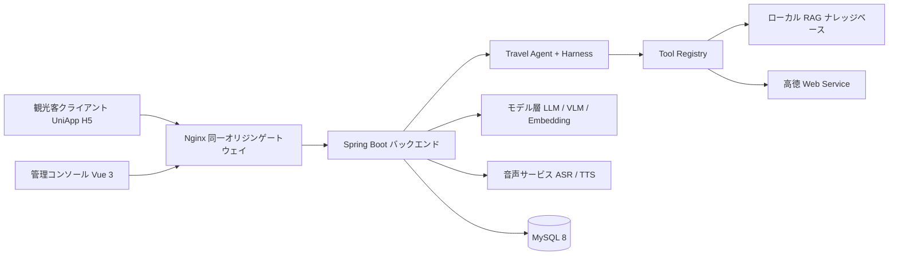

# 旅霊 AI Travel Agent

> Guido をベースに二次開発した多都市対応の AI 旅行デジタル社員

[简体中文](README.md) | [English](README.en.md) | **日本語** | [한국어](README.ko.md)

## 概要

旅霊は、散在する景区資料、リアルタイムの POI / 天気 / ルート情報、そして大規模モデルの生成能力を、追跡可能なひとつの AI 旅行デジタル社員に統合します。現行バージョンは `Travel Agent + Harness + Tool Calling + Provider + CityContext + RAG + Digital Human` の増分アーキテクチャとして構成され、UniApp Web/H5 観光客クライアント、Vue 3 管理コンソール、Spring Boot バックエンドの三つを提供します。

- **観光客向け：** 景区資料を追跡可能なスマート Q&A に変換し、テキスト・音声・写真入力に対応、興味に応じて観覧ルートを提案します。
- **運用担当者向け：** 景区、観光スポット、ルート、ナレッジ資料、モデル設定、デジタルガイド形象を一元管理し、ダッシュボードで頻出質問・人気スポット・来訪者の感情を把握できます。
- **エンジニアリング向け：** プロトコル適配層でベンダー差異を隔離し、ローカル知識検索、SSE ストリーミング、資格情報の暗号化、呼び出しログによって、主要経路の保守性・縮退性・調査性を確保します。

本番環境は同一オリジンの HTTPS で運用します。ブラウザは静的 H5 を読み込み、`/api` はリバースプロキシでバックエンドへ転送され、サードパーティのキーはサーバー側の環境変数または暗号化設定にのみ保存されます。

## 主な機能

| モジュール | 主な能力 |
| --- | --- |
| マルチモーダル案内 | テキスト Q&A、音声 Q&A、写真による景観認識、文脈付き会話、資料引用 |
| Travel Agent | 意図抽出、タスク計画、Harness 実行、Tool Registry の振り分け、結果検証、ExecutionTrace |
| 動的都市 | 都市名またはブラウザ位置情報から CityContext を解決し、ローカル都市と高徳の動的検出に対応 |
| 高徳（AMap）連携 | ジオコーディング、POI、天気、徒歩ルート、実座標、地図 Polyline |
| ローカル RAG | ドキュメント管理、オーバーラップ分割、ベクトル化、Top-K 検索、キーワードフォールバック、検索テスト |
| ストリーミング | SSE 差分テキスト、認識結果、引用元、感情、音声 URL、段階別の所要時間 |
| 個別化ルート | 興味タグのマッチング、ルートの重み付きランキング、所要時間、推薦理由、スポット順序 |
| デジタルガイド | 形象の選択、音色と話速の設定、TTS 再生、Canvas ステートアニメーション |
| AI サービス管理 | LLM、VLM、Embedding、ASR、TTS の設定、疎通テスト、既定サービスの切り替え |
| 運用分析 | 頻出質問、人気スポット、感情分布、ナレッジヒット率、所要時間の推移、Word レポート |
| 管理コンソール | 景区、スポット、ルート、ナレッジベース、観光客、フィードバック、会話、ログ、ダッシュボードの管理 |

> LLM、ASR、TTS、高徳 Web Service などの外部機能は、デプロイ環境または管理コンソールで対応する Provider を設定する必要があります。設定が不足している場合、システムはモックデータで実結果を装うことなく、利用不可の状態を明示的に返します。

## アーキテクチャ



## 技術スタック

| 領域 | 技術 |
| --- | --- |
| バックエンド | Java 17、Spring Boot 3.2.5、Maven |
| データアクセス | MyBatis-Plus 3.5.5、MySQL 8、Redis |
| API と認証 | RESTful API、SSE、Sa-Token 1.38.0、Bean Validation |
| AI 能力 | OpenAI-Compatible、Anthropic-Compatible、Embedding、VLM、ローカル RAG |
| 音声 | 阿里雲 ASR、阿里雲 TTS |
| バックエンド基盤 | Spring AOP、BCrypt、AES-GCM、Knife4j 4.5.0、Hutool |
| 管理コンソール | Vue 3.4、TypeScript 5.4、Vite 5.2、Element Plus 2.7、Pinia、ECharts 5.5 |
| 観光客クライアント | UniApp、Vue 3.4、TypeScript、Three.js、Fetch Stream / SSE |

## プロジェクト構成

```text
Guido-main/
├── backend/                        Spring Boot 3 バックエンドサービス
│   └── src/main/java/com/guido/scenicai/
│       ├── agent/                  Travel Agent：意図抽出、タスク計画、Harness、Skill
│       ├── tool/                   Tool Registry：都市、POI、ルート、天気、RAG、予算、検証
│       ├── integration/            AMap、LLM、VLM、Embedding、Aliyun Provider
│       ├── module/                 業務モジュール：admin、aiconfig、avatar、chat、city、dashboard、
│       │                           feature、feedback、file、knowledge、log、map、route、
│       │                           scenic、sentiment、sos、spot、tourist
│       ├── domain/                 旅行計画とルートのドメインモデル
│       ├── common/                 共通レスポンス、例外、認証、暗号化、ヘルスチェック
│       └── job/                    日次集計ジョブ
├── admin-web/                      Vue 3 + Element Plus 管理コンソール
├── tourist-app/                    UniApp H5 観光客クライアントとデジタルヒューマン UI
├── database/                       schema.sql、data.sql、増分マイグレーション
├── assets/                         ナレッジ資料とデジタルガイドのリソース
├── models/                         デジタルヒューマンのモデル資産
├── outputs/                        デジタルヒューマンの生成物
├── scripts/                        デジタルヒューマンの診断・テストスクリプト
├── third_party/                    デジタルヒューマンと旅程可視化の OSS 参考実装
└── docs/                           要件、設計、アーキテクチャ、API、デプロイ文書
```

## クイックスタート

### 動作環境

| ツール | バージョン |
| --- | --- |
| JDK | 17 |
| Maven | 3.9.x |
| MySQL | 8.x |
| Node.js | 20.11.1 |
| pnpm | 8.15.4 |
| 観光客クライアント | HBuilderX |

### データベースの初期化

`schema.sql` は `scenic_ai_guide` データベースを作成して選択します：

```bash
mysql --default-character-set=utf8mb4 -u root -p < database/schema.sql
mysql --default-character-set=utf8mb4 -u root -p < database/data.sql
mysql --default-character-set=utf8mb4 -u root -p scenic_ai_guide < database/migration/phase3_city_context.sql
mysql --default-character-set=utf8mb4 -u root -p scenic_ai_guide < database/migration/sos_request.sql
```

### バックエンドの起動

PowerShell：

```powershell
cd backend
$env:DB_PASSWORD = Read-Host 'MySQL のパスワード'
$env:AI_CONFIG_AES_KEY = Read-Host '32 文字以上のローカル暗号化キー'
$env:AMAP_WEB_SERVICE_KEY = Read-Host '高徳 Web Service キー'
mvn spring-boot:run
```

- バックエンド：`http://localhost:8080`
- Knife4j API ドキュメント：`http://localhost:8080/doc.html`

### 管理コンソールの起動

```powershell
cd admin-web
corepack pnpm install --frozen-lockfile
corepack pnpm exec vite
```

管理コンソールの既定アドレスは `http://localhost:5173` です。

### 観光客クライアントの起動

1. `tourist-app/.env.example` を `.env.local` に複製し、高徳 Web 用の JS キーとセキュリティコードを設定します。
2. HBuilderX で `tourist-app` を開いてブラウザへ実行するか、同ディレクトリで `npm run build` を実行して H5 本番ファイルを生成します。
3. 開発環境では `VITE_DEV_PROXY_TARGET` をバックエンドに向け、本番環境では同一オリジンの `/api` を使用します。業務コンポーネントにバックエンドのアドレスを直書きしないでください。

## 主要 API

| メソッド | パス | 説明 |
| --- | --- | --- |
| `POST` | `/api/tourist/auth/register`、`/login` | 観光客の登録とログイン |
| `POST` | `/api/tourist/chat/text` | テキスト Q&A |
| `POST` | `/api/tourist/chat/text/stream` | テキスト Q&A（SSE） |
| `POST` | `/api/tourist/chat/voice`、`/voice/stream` | 音声 Q&A（通常 / SSE） |
| `POST` | `/api/tourist/vision/recognize` | 写真から景観を認識し解説を生成 |
| `GET` | `/api/tourist/route/recommend` | 興味に基づくルート推薦 |
| `GET` | `/api/tourist/cities` | 都市一覧と CityContext |
| `GET` | `/api/tourist/amap/poi`、`/geocode` | 高徳 POI 検索とジオコーディング |
| `GET` | `/api/tourist/scenic/hot` | 人気景区 |
| `POST` | `/api/tourist/session/create` | セッションの作成 |
| `GET` | `/api/tourist/agent/status` | Travel Agent とツールの準備状態 |
| `POST` | `/api/admin/knowledge/upload` | ナレッジ文書のアップロードと分割登録 |
| `GET` | `/api/admin/dashboard/overview` | 運用ダッシュボードの概要 |
| `POST` | `/api/admin/sentiment/generate` | 来訪者感情レポートの生成 |

### SSE イベント

| イベント | 内容 |
| --- | --- |
| `asr` | 音声認識テキスト。音声 Q&A のみ返却 |
| `meta` | セッション番号とメッセージ ID |
| `delta` | モデルの差分回答 |
| `sources` | ナレッジヒット状態と引用元 |
| `emotion` | ポジティブ、ニュートラル、ネガティブ、クレームの感情 |
| `audio` | TTS 音声 URL |
| `done` | 合計所要時間、実行状態、段階別所要時間 |

## 本番デプロイ

公開 HTTPS ドメインを一つ用意することを推奨します。Nginx が `tourist-app/unpackage/dist/build/h5` を配信し、`/api/**` と `/files/**` を Spring Boot へリバースプロキシします。データベースのパスワード、高徳 Web Service キー、JWT、AI 設定の暗号化キーは、デプロイ基盤の環境変数から注入してください。

詳細な手順は [本番デプロイガイド](docs/PRODUCTION_DEPLOYMENT.md) を参照してください。

## セキュリティ設計

- 管理者と観光客は Sa-Token のログイン処理を分離し、アカウント体系の混用を防ぎます。
- ユーザーパスワードは BCrypt の一方向ハッシュで保存し、電話番号などの機微情報は API 層でマスクします。
- AI サービスの API Key、AccessKeyId、AccessKeySecret は AES-GCM で暗号化してから永続化します。
- `.env`、ローカルおよび本番の設定、実行ログ、アップロードファイル、ビルド成果物はすべて `.gitignore` に含まれます。
- リポジトリに実際のサードパーティ資格情報は含まれません。デプロイ時には独立したデータベースパスワードと安定した `AI_CONFIG_AES_KEY` を必ず設定してください。
- `database/data.sql` はローカルデモ用の初期化専用です。公開環境へデプロイする前に、含まれるサンプルアカウントを差し替えてください。

## ビルド確認

```powershell
cd backend
mvn test

cd ../admin-web
corepack pnpm install --frozen-lockfile
corepack pnpm run build

cd ../tourist-app
npm run type-check
npm run build
```

## ドキュメント

要件、設計、アーキテクチャ、データと API、開発実行、受け入れ検証を含む全体の索引は [docs/README.md](docs/README.md) を参照してください。

## クレジット

- 本リポジトリ：[github.com/XY-code1/LvLing-Travel-Agent](https://github.com/XY-code1/LvLing-Travel-Agent)
- 上流プロジェクト：[github.com/youxiandechilun/Guido](https://github.com/youxiandechilun/Guido)

`third_party/` のデジタルヒューマンと旅程可視化は、HeyGem.ai、Linly-Talker、MuseTalk、travel-plan-wiz などのオープンソース実装を参考にしています。著作権は各原作者に帰属します。
