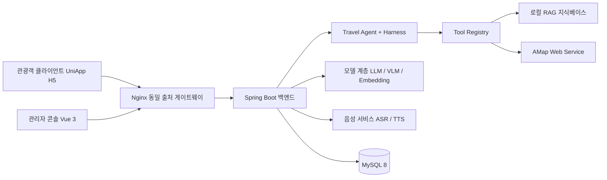

# 여령 AI Travel Agent

> Guido를 기반으로 2차 개발한 다도시 AI 여행 디지털 직원

[简体中文](README.md) | [English](README.en.md) | [日本語](README.ja.md) | **한국어**

## 개요

여령은 흩어진 관광지 자료, 실시간 POI / 날씨 / 경로 정보, 대규모 모델의 생성 능력을 하나의 추적 가능한 AI 여행 디지털 직원으로 통합합니다. 현재 버전은 `Travel Agent + Harness + Tool Calling + Provider + CityContext + RAG + Digital Human` 증분 아키텍처로 구성되며, UniApp Web/H5 관광객 클라이언트, Vue 3 관리자 콘솔, Spring Boot 백엔드 세 부분을 제공합니다.

- **관광객 대상:** 관광지 자료를 추적 가능한 지능형 Q&A로 전환하고, 텍스트·음성·사진 입력을 지원하며, 관심사에 따라 관람 경로를 추천합니다.
- **운영자 대상:** 관광지, 명소, 경로, 지식 자료, 모델 설정, 디지털 가이드 형상을 통합 관리하고, 대시보드로 빈출 질문·인기 명소·방문자 감정을 파악합니다.
- **엔지니어링 대상:** 프로토콜 적응 계층으로 벤더 차이를 격리하고, 로컬 지식 검색·SSE 스트리밍·자격 증명 암호화·호출 로그를 통해 핵심 경로의 유지보수성, 성능 저하 대응력, 추적 가능성을 확보합니다.

프로덕션 환경은 동일 출처 HTTPS로 운영합니다. 브라우저는 정적 H5를 로드하고, `/api`는 리버스 프록시를 통해 백엔드로 전달되며, 서드파티 키는 서버 측 환경 변수 또는 암호화된 설정에만 저장됩니다.

## 주요 기능

| 모듈 | 주요 능력 |
| --- | --- |
| 멀티모달 안내 | 텍스트 Q&A, 음성 Q&A, 사진 명소 인식, 문맥형 세션, 자료 인용 |
| Travel Agent | 의도 추출, 작업 계획, Harness 실행, Tool Registry 디스패치, 결과 검증, ExecutionTrace |
| 동적 도시 | 도시 이름 또는 브라우저 위치로 CityContext를 해석하며, 로컬 도시와 AMap 동적 탐색을 지원 |
| AMap 연동 | 지오코딩, POI, 날씨, 도보 경로, 실제 좌표, 지도 Polyline |
| 로컬 RAG | 문서 관리, 중첩 분할, 벡터화, Top-K 검색, 키워드 폴백, 검색 테스트 |
| 스트리밍 | SSE 증분 텍스트, 인식 결과, 인용 출처, 감정, 오디오 주소, 단계별 소요 시간 |
| 개인화 경로 | 관심 태그 매칭, 경로 가중 정렬, 예상 소요 시간, 추천 사유, 명소 순서 |
| 디지털 가이드 | 형상 선택, 음색과 속도 설정, TTS 재생, Canvas 상태 애니메이션 |
| AI 서비스 관리 | LLM, VLM, Embedding, ASR, TTS 설정, 연결 테스트, 기본 서비스 전환 |
| 운영 분석 | 인기 질문, 인기 명소, 감정 분포, 지식 적중률, 소요 시간 추이, Word 리포트 |
| 관리자 콘솔 | 관광지, 명소, 경로, 지식베이스, 관광객, 피드백, 세션, 로그, 대시보드 관리 |

> LLM, ASR, TTS, AMap Web Service 등 외부 기능은 배포 환경 또는 관리자 콘솔에서 해당 Provider를 설정해야 합니다. 설정이 없으면 시스템은 목 데이터로 실제 결과를 가장하지 않고 사용 불가 상태를 명확히 반환합니다.

## 아키텍처



## 기술 스택

| 영역 | 기술 |
| --- | --- |
| 백엔드 | Java 17, Spring Boot 3.2.5, Maven |
| 데이터 접근 | MyBatis-Plus 3.5.5, MySQL 8, Redis |
| API와 인증 | RESTful API, SSE, Sa-Token 1.38.0, Bean Validation |
| AI 능력 | OpenAI-Compatible, Anthropic-Compatible, Embedding, VLM, 로컬 RAG |
| 음성 | 알리바바 클라우드 ASR, 알리바바 클라우드 TTS |
| 백엔드 기반 | Spring AOP, BCrypt, AES-GCM, Knife4j 4.5.0, Hutool |
| 관리자 콘솔 | Vue 3.4, TypeScript 5.4, Vite 5.2, Element Plus 2.7, Pinia, ECharts 5.5 |
| 관광객 클라이언트 | UniApp, Vue 3.4, TypeScript, Three.js, Fetch Stream / SSE |

## 프로젝트 구조

```text
Guido-main/
├── backend/                        Spring Boot 3 백엔드 서비스
│   └── src/main/java/com/guido/scenicai/
│       ├── agent/                  Travel Agent: 의도 추출, 작업 계획, Harness, Skill
│       ├── tool/                   Tool Registry: 도시, POI, 경로, 날씨, RAG, 예산, 검증
│       ├── integration/            AMap, LLM, VLM, Embedding, Aliyun Provider
│       ├── module/                 비즈니스 모듈: admin, aiconfig, avatar, chat, city, dashboard,
│       │                           feature, feedback, file, knowledge, log, map, route,
│       │                           scenic, sentiment, sos, spot, tourist
│       ├── domain/                 여행 계획과 경로 도메인 모델
│       ├── common/                 공통 응답, 예외, 인증, 암호화, 헬스 체크
│       └── job/                    일일 집계 작업
├── admin-web/                      Vue 3 + Element Plus 관리자 콘솔
├── tourist-app/                    UniApp H5 관광객 클라이언트와 디지털 휴먼 UI
├── database/                       schema.sql, data.sql, 증분 마이그레이션
├── assets/                         지식 자료와 디지털 가이드 리소스
├── models/                         디지털 휴먼 모델 자산
├── outputs/                        디지털 휴먼 생성 산출물
├── scripts/                        디지털 휴먼 진단 및 테스트 스크립트
├── third_party/                    디지털 휴먼과 여정 시각화 오픈소스 참고 구현
└── docs/                           요구사항, 설계, 아키텍처, API, 배포 문서
```

## 빠른 시작

### 환경 요구사항

| 도구 | 버전 |
| --- | --- |
| JDK | 17 |
| Maven | 3.9.x |
| MySQL | 8.x |
| Node.js | 20.11.1 |
| pnpm | 8.15.4 |
| 관광객 클라이언트 | HBuilderX |

### 데이터베이스 초기화

`schema.sql`은 `scenic_ai_guide` 데이터베이스를 생성하고 선택합니다:

```bash
mysql --default-character-set=utf8mb4 -u root -p < database/schema.sql
mysql --default-character-set=utf8mb4 -u root -p < database/data.sql
mysql --default-character-set=utf8mb4 -u root -p scenic_ai_guide < database/migration/phase3_city_context.sql
mysql --default-character-set=utf8mb4 -u root -p scenic_ai_guide < database/migration/sos_request.sql
```

### 백엔드 실행

PowerShell:

```powershell
cd backend
$env:DB_PASSWORD = Read-Host 'MySQL 비밀번호'
$env:AI_CONFIG_AES_KEY = Read-Host '32자 이상의 로컬 암호화 키'
$env:AMAP_WEB_SERVICE_KEY = Read-Host 'AMap Web Service 키'
mvn spring-boot:run
```

- 백엔드: `http://localhost:8080`
- Knife4j API 문서: `http://localhost:8080/doc.html`

### 관리자 콘솔 실행

```powershell
cd admin-web
corepack pnpm install --frozen-lockfile
corepack pnpm exec vite
```

관리자 콘솔 기본 주소는 `http://localhost:5173`입니다.

### 관광객 클라이언트 실행

1. `tourist-app/.env.example`을 `.env.local`로 복사하고 AMap Web용 JS 키와 보안 코드를 입력합니다.
2. HBuilderX로 `tourist-app`을 열어 브라우저에서 실행하거나, 해당 디렉터리에서 `npm run build`를 실행해 H5 프로덕션 파일을 생성합니다.
3. 개발 환경에서는 `VITE_DEV_PROXY_TARGET`을 백엔드로 지정하고, 프로덕션 환경에서는 동일 출처 `/api`를 사용하며 비즈니스 컴포넌트에 백엔드 주소를 하드코딩하지 않습니다.

## 주요 API

| 메서드 | 경로 | 설명 |
| --- | --- | --- |
| `POST` | `/api/tourist/auth/register`, `/login` | 관광객 회원가입과 로그인 |
| `POST` | `/api/tourist/chat/text` | 텍스트 Q&A |
| `POST` | `/api/tourist/chat/text/stream` | 텍스트 Q&A (SSE) |
| `POST` | `/api/tourist/chat/voice`, `/voice/stream` | 음성 Q&A (일반 / SSE) |
| `POST` | `/api/tourist/vision/recognize` | 사진으로 명소를 인식하고 해설 생성 |
| `GET` | `/api/tourist/route/recommend` | 관심사 기반 경로 추천 |
| `GET` | `/api/tourist/cities` | 도시 목록과 CityContext |
| `GET` | `/api/tourist/amap/poi`, `/geocode` | AMap POI 검색과 지오코딩 |
| `GET` | `/api/tourist/scenic/hot` | 인기 관광지 |
| `POST` | `/api/tourist/session/create` | 세션 생성 |
| `GET` | `/api/tourist/agent/status` | Travel Agent와 도구 준비 상태 |
| `POST` | `/api/admin/knowledge/upload` | 지식 문서 업로드와 분할 저장 |
| `GET` | `/api/admin/dashboard/overview` | 운영 대시보드 개요 |
| `POST` | `/api/admin/sentiment/generate` | 방문자 감정 리포트 생성 |

### SSE 이벤트

| 이벤트 | 내용 |
| --- | --- |
| `asr` | 음성 인식 텍스트, 음성 Q&A에서만 반환 |
| `meta` | 세션 번호와 메시지 ID |
| `delta` | 모델 증분 응답 |
| `sources` | 지식 적중 상태와 인용 출처 |
| `emotion` | 긍정, 중립, 부정, 불만 감정 |
| `audio` | TTS 오디오 주소 |
| `done` | 총 소요 시간, 실행 상태, 단계별 소요 시간 |

## 프로덕션 배포

공인 HTTPS 도메인 하나를 사용하는 것을 권장합니다. Nginx가 `tourist-app/unpackage/dist/build/h5`를 제공하고 `/api/**`와 `/files/**`를 Spring Boot로 리버스 프록시합니다. 데이터베이스 비밀번호, AMap Web Service 키, JWT, AI 설정 암호화 키는 반드시 배포 플랫폼의 환경 변수로 주입해야 합니다.

전체 절차는 [프로덕션 배포 가이드](docs/PRODUCTION_DEPLOYMENT.md)를 참고하세요.

## 보안 설계

- 관리자와 관광객은 Sa-Token 로그인 로직을 분리해 계정 체계 혼용을 방지합니다.
- 사용자 비밀번호는 BCrypt 단방향 해시로 저장하고, 휴대전화 번호 등 민감 정보는 API 계층에서 마스킹합니다.
- AI 서비스의 API Key, AccessKeyId, AccessKeySecret은 AES-GCM으로 암호화한 뒤 저장합니다.
- `.env`, 로컬 및 프로덕션 설정, 실행 로그, 업로드 파일, 빌드 산출물은 모두 `.gitignore`에 포함되어 있습니다.
- 저장소에는 실제 서드파티 자격 증명이 포함되지 않습니다. 배포 시 독립적인 데이터베이스 비밀번호와 안정적인 `AI_CONFIG_AES_KEY`를 반드시 설정하세요.
- `database/data.sql`은 로컬 데모 초기화 전용입니다. 공개 환경에 배포하기 전에 포함된 샘플 계정을 교체하세요.

## 빌드 검증

```powershell
cd backend
mvn test

cd ../admin-web
corepack pnpm install --frozen-lockfile
corepack pnpm run build

cd ../tourist-app
npm run type-check
npm run build
```

## 문서

요구사항, 설계, 아키텍처, 데이터와 API, 개발 실행, 인수 검증을 포함한 전체 색인은 [docs/README.md](docs/README.md)에서 확인할 수 있습니다.

## 크레딧

- 현재 저장소: [github.com/XY-code1/LvLing-Travel-Agent](https://github.com/XY-code1/LvLing-Travel-Agent)
- 업스트림 프로젝트: [github.com/youxiandechilun/Guido](https://github.com/youxiandechilun/Guido)

`third_party/`의 디지털 휴먼과 여정 시각화는 HeyGem.ai, Linly-Talker, MuseTalk, travel-plan-wiz 등의 오픈소스 구현을 참고했습니다. 저작권은 각 원저작자에게 있습니다.
