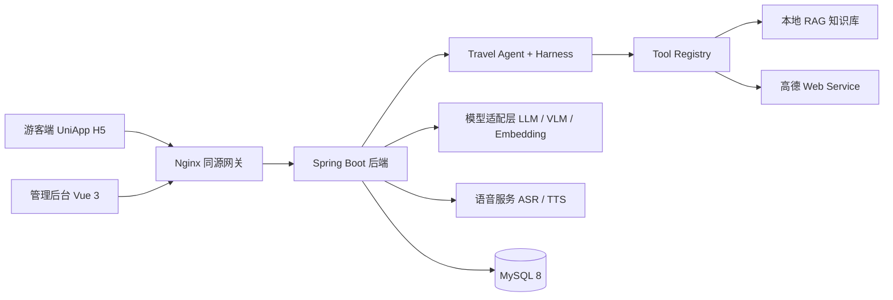

# 旅灵 AI Travel Agent

> 基于 Guido 二次开发的多城市 AI 旅行数字员工

**简体中文** | [English](README.en.md) | [日本語](README.ja.md) | [한국어](README.ko.md)

## 项目简介

旅灵把分散的景区资料、实时的 POI / 天气 / 路线能力与大模型生成能力，整合成一个可追溯的 AI 旅行数字员工。当前版本已形成 `Travel Agent + Harness + Tool Calling + Provider + CityContext + RAG + Digital Human` 的增量架构，包含 UniApp Web/H5 游客端、Vue 3 管理后台与 Spring Boot 后端三部分。

- **面向游客：** 把景区资料转换为可追溯的智能问答，支持文字、语音和拍照输入，并按兴趣推荐游览路线。
- **面向运营人员：** 统一维护景区、景点、路线、知识资料、模型配置与数字导游形象，通过数据看板掌握高频问题、热门景点和游客情绪。
- **面向工程落地：** 以模型协议适配层隔离厂商差异，通过本地知识检索、SSE 流式输出、凭据加密和调用日志，保证核心链路可维护、可降级、可排查。

生产环境采用同源 HTTPS：浏览器访问静态 H5，`/api` 由反向代理转发至后端，第三方服务密钥仅保存在服务端环境变量或加密配置中。

## 核心功能

| 模块 | 主要能力 |
| --- | --- |
| 多模态导览 | 文本问答、语音问答、拍照识景、上下文会话与资料引用 |
| Travel Agent | 意图提取、任务规划、Harness 执行、Tool Registry 调度、结果校验与 ExecutionTrace |
| 动态城市 | 依据城市名或浏览器定位解析 CityContext，支持本地城市与高德动态发现 |
| 高德能力 | 地理编码、POI、天气、步行路线、真实坐标与地图 Polyline |
| 本地 RAG | 文档管理、重叠分片、向量化、Top-K 检索、关键词兜底与检索测试 |
| 流式响应 | SSE 增量文本、识别结果、引用来源、情绪、音频地址与阶段耗时 |
| 个性化路线 | 兴趣标签匹配、路线加权排序、预计时长、推荐理由与景点顺序 |
| 数字导游 | 形象选择、音色与语速配置、TTS 播报与 Canvas 状态动画 |
| AI 服务管理 | LLM、VLM、Embedding、ASR、TTS 配置、能力测试与默认服务切换 |
| 运营分析 | 热门问题、热门景点、情绪分布、知识库命中率、耗时趋势与 Word 报告 |
| 后台管理 | 景区、景点、路线、知识库、游客、反馈、会话、日志与数据大屏 |

> LLM、ASR、TTS、高德 Web Service 等外部能力需要在部署环境或管理后台配置对应 Provider；缺少配置时系统会明确返回不可用状态，不会用 Mock 数据冒充真实结果。

## 架构总览



## 技术栈

| 领域 | 技术 |
| --- | --- |
| 后端 | Java 17、Spring Boot 3.2.5、Maven |
| 数据访问 | MyBatis-Plus 3.5.5、MySQL 8、Redis |
| 接口与鉴权 | RESTful API、SSE、Sa-Token 1.38.0、Bean Validation |
| AI 能力 | OpenAI-Compatible、Anthropic-Compatible、Embedding、VLM、本地 RAG |
| 语音能力 | 阿里云 ASR、阿里云 TTS |
| 后端工程 | Spring AOP、BCrypt、AES-GCM、Knife4j 4.5.0、Hutool |
| 管理后台 | Vue 3.4、TypeScript 5.4、Vite 5.2、Element Plus 2.7、Pinia、ECharts 5.5 |
| 游客端 | UniApp、Vue 3.4、TypeScript、Three.js、Fetch Stream / SSE |

## 项目结构

```text
Guido-main/
├── backend/                        Spring Boot 3 后端服务
│   └── src/main/java/com/guido/scenicai/
│       ├── agent/                  Travel Agent：意图提取、任务规划、Harness、Skill
│       ├── tool/                   Tool Registry：城市、POI、路线、天气、RAG、预算、校验等工具
│       ├── integration/            AMap、LLM、VLM、Embedding、Aliyun Provider
│       ├── module/                 业务模块：admin、aiconfig、avatar、chat、city、dashboard、
│       │                           feature、feedback、file、knowledge、log、map、route、
│       │                           scenic、sentiment、sos、spot、tourist
│       ├── domain/                 旅行计划与路线领域模型
│       ├── common/                 统一响应、异常、鉴权、加密与健康检查
│       └── job/                    每日统计任务
├── admin-web/                      Vue 3 + Element Plus 管理后台
├── tourist-app/                    UniApp H5 游客端与数字人界面
├── database/                       schema.sql、data.sql 与增量迁移脚本
├── assets/                         知识资料与数字导游资源
├── models/                         数字人模型资源
├── outputs/                        数字人生成产物
├── scripts/                        数字人诊断与测试脚本
├── third_party/                    数字人与行程可视化开源参考实现
└── docs/                           需求、设计、架构、接口与部署文档
```

## 快速开始

### 环境要求

| 工具 | 版本 |
| --- | --- |
| JDK | 17 |
| Maven | 3.9.x |
| MySQL | 8.x |
| Node.js | 20.11.1 |
| pnpm | 8.15.4 |
| 游客端工具 | HBuilderX |

### 初始化数据库

`schema.sql` 会自动创建并选择 `scenic_ai_guide` 数据库：

```bash
mysql --default-character-set=utf8mb4 -u root -p < database/schema.sql
mysql --default-character-set=utf8mb4 -u root -p < database/data.sql
mysql --default-character-set=utf8mb4 -u root -p scenic_ai_guide < database/migration/phase3_city_context.sql
mysql --default-character-set=utf8mb4 -u root -p scenic_ai_guide < database/migration/sos_request.sql
```

### 启动后端

PowerShell：

```powershell
cd backend
$env:DB_PASSWORD = Read-Host '请输入 MySQL 密码'
$env:AI_CONFIG_AES_KEY = Read-Host '请输入至少 32 位的本地加密密钥'
$env:AMAP_WEB_SERVICE_KEY = Read-Host '请输入高德 Web Service Key'
mvn spring-boot:run
```

- 后端地址：`http://localhost:8080`
- Knife4j 接口文档：`http://localhost:8080/doc.html`

### 启动管理后台

```powershell
cd admin-web
corepack pnpm install --frozen-lockfile
corepack pnpm exec vite
```

管理后台默认地址为 `http://localhost:5173`。

### 启动游客端

1. 将 `tourist-app/.env.example` 复制为 `.env.local`，填写高德 Web 端 JS Key 与安全密钥。
2. 使用 HBuilderX 打开 `tourist-app` 并运行到浏览器，或在目录中执行 `npm run build` 生成 H5 生产文件。
3. 开发环境通过 `VITE_DEV_PROXY_TARGET` 指向后端；生产环境默认使用同源 `/api`，不在业务组件中写死后端地址。

## 核心接口

| 方法 | 路径 | 说明 |
| --- | --- | --- |
| `POST` | `/api/tourist/auth/register`、`/login` | 游客注册与登录 |
| `POST` | `/api/tourist/chat/text` | 文本问答 |
| `POST` | `/api/tourist/chat/text/stream` | 文本问答（SSE 流式） |
| `POST` | `/api/tourist/chat/voice`、`/voice/stream` | 语音问答（普通 / SSE） |
| `POST` | `/api/tourist/vision/recognize` | 拍照识别景点并生成讲解 |
| `GET` | `/api/tourist/route/recommend` | 兴趣驱动的路线推荐 |
| `GET` | `/api/tourist/cities` | 城市列表与 CityContext |
| `GET` | `/api/tourist/amap/poi`、`/geocode` | 高德 POI 检索与地理编码 |
| `GET` | `/api/tourist/scenic/hot` | 热门景区 |
| `POST` | `/api/tourist/session/create` | 创建会话 |
| `GET` | `/api/tourist/agent/status` | Travel Agent 与工具就绪状态 |
| `POST` | `/api/admin/knowledge/upload` | 知识库文档上传与分块入库 |
| `GET` | `/api/admin/dashboard/overview` | 运营看板总览 |
| `POST` | `/api/admin/sentiment/generate` | 生成游客感受度报告 |

### SSE 事件

| 事件 | 内容 |
| --- | --- |
| `asr` | 语音识别文本，仅语音问答返回 |
| `meta` | 会话编号与消息 ID |
| `delta` | 模型增量回答 |
| `sources` | 知识库命中状态与引用来源 |
| `emotion` | 正向、中性、负向或投诉情绪 |
| `audio` | TTS 音频地址 |
| `done` | 总耗时、执行状态与阶段耗时 |

## 生产部署

推荐使用一个公网 HTTPS 域名：Nginx 提供 `tourist-app/unpackage/dist/build/h5`，并将 `/api/**` 与 `/files/**` 反向代理至 Spring Boot。数据库密码、高德 Web Service Key、JWT、AI 配置加密密钥等必须通过部署平台环境变量注入。

完整步骤见 [生产部署指南](docs/PRODUCTION_DEPLOYMENT.md)。

## 安全设计

- 管理员与游客使用独立的 Sa-Token 登录逻辑，避免账号体系混用。
- 用户密码使用 BCrypt 单向哈希保存，手机号等敏感信息在接口层脱敏。
- AI 服务的 API Key、AccessKeyId 与 AccessKeySecret 使用 AES-GCM 加密后入库。
- `.env`、本地与生产配置、运行日志、上传文件和构建产物均已加入 `.gitignore`。
- 仓库不包含真实第三方服务凭据；部署时必须设置独立数据库密码与稳定的 `AI_CONFIG_AES_KEY`。
- `database/data.sql` 仅用于本地演示初始化，部署到公开环境前应替换其中的示例账号。

## 构建检查

```powershell
cd backend
mvn test

cd ../admin-web
corepack pnpm install --frozen-lockfile
corepack pnpm run build

cd ../tourist-app
npm run type-check
npm run build
```

## 文档索引

完整文档入口见 [docs/README.md](docs/README.md)，其中包含需求、设计、架构、数据与接口、开发执行和交付验收等内容。

## 上游与致谢

- 当前仓库：[github.com/XY-code1/LvLing-Travel-Agent](https://github.com/XY-code1/LvLing-Travel-Agent)
- 上游项目：[github.com/youxiandechilun/Guido](https://github.com/youxiandechilun/Guido)

`third_party/` 中的数字人与行程可视化能力参考了 HeyGem.ai、Linly-Talker、MuseTalk、travel-plan-wiz 等开源实现，版权归原作者所有。
