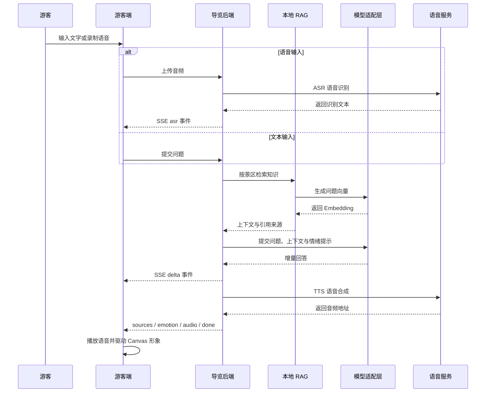

# 旅灵 AI Travel Agent

旅灵是基于 Guido 二次开发的多城市 AI 旅行数字员工。当前版本已经形成 `Travel Agent + Harness + Tool Calling + Provider + CityContext + RAG + Digital Human` 的增量架构，并提供 UniApp Web/H5 游客端、Vue 3 管理后台和 Spring Boot 后端。

系统支持自然语言旅行规划、动态城市发现、真实 POI/天气/路线查询、结构化行程、地图展示、本地 RAG、语音服务与数字人交互。生产环境采用同源 HTTPS：浏览器访问静态 H5，`/api` 由反向代理转发至后端，第三方服务密钥仅保存在服务端环境变量或加密配置中。

| 项目信息 | 内容 |
| --- | --- |
| 项目角色 | 项目负责人 / 全栈与 AI 应用开发 |
| 主要职责 | 系统设计、数据库建模、后端开发、AI 服务集成、游客端与管理后台实现 |
| 当前仓库 | [github.com/XY-code1/LvLing-Travel-Agent](https://github.com/XY-code1/LvLing-Travel-Agent) |
| 上游项目 | [github.com/youxiandechilun/Guido](https://github.com/youxiandechilun/Guido) |

## 项目价值

- **面向游客：** 将分散的景区资料转换为可追溯的智能问答，支持文字、语音和图片输入，并根据兴趣推荐游览路线。
- **面向运营人员：** 统一维护景区、景点、路线、知识资料、模型配置与数字导游形象，通过数据看板了解高频问题、热门景点和游客情绪。
- **面向工程落地：** 使用模型协议适配层隔离厂商差异，通过本地知识检索、SSE 流式输出、凭据加密和调用日志保证核心链路可维护、可降级、可排查。

## 个人职责

- 负责项目整体方案、数据库模型和后端模块设计，基于 Java 17 与 Spring Boot 3.2.5 提供 RESTful API、统一响应、参数校验、异常处理和双账号鉴权。
- 设计“文本/语音输入 -> 本地 RAG 检索 -> 大模型生成 -> 语音合成 -> Canvas 数字导游播报”的交互链路，并接入图片识别能力。
- 建设景区本地 RAG 知识库，实现文本资料入库、重叠分片、Embedding 向量化、MySQL 持久化、余弦相似度 Top-K 召回、关键词降级检索和引用溯源。
- 封装 LLM、VLM、Embedding、ASR 与 TTS 服务适配层，支持动态配置、协议路由、连通性测试、超时控制、凭据加密与调用日志。
- 实现兴趣驱动的路线推荐，输出推荐理由、预计时长和有序景点列表；建设对话、反馈、情绪和知识库命中数据的运营分析能力。
- 完成游客端与管理后台的主要业务界面和接口联调，覆盖导览问答、识景、路线、知识库、模型配置、运营看板和报告导出。

## 核心功能

| 模块 | 主要能力 |
| --- | --- |
| 多模态导览 | 文本问答、语音问答、拍照识景、上下文会话与资料引用 |
| Travel Agent | 意图提取、任务规划、Harness 执行、Tool Registry、结果校验与 ExecutionTrace |
| 动态城市 | 城市名或浏览器定位解析 CityContext，支持本地城市与高德动态发现 |
| 高德能力 | 地理编码、POI、天气、步行路线、真实坐标与地图 Polyline |
| 本地 RAG | 文档管理、重叠分片、向量化、Top-K 检索、关键词兜底与检索测试 |
| 流式响应 | SSE 增量文本、识别结果、引用来源、情绪、音频地址和阶段耗时 |
| 个性化路线 | 兴趣标签匹配、路线加权排序、预计时长、推荐理由与景点顺序 |
| 数字导游 | 形象选择、音色与语速配置、TTS 播报和 Canvas 状态动画 |
| AI 服务管理 | LLM、VLM、Embedding、ASR、TTS 配置、能力测试与默认服务切换 |
| 运营分析 | 热门问题、热门景点、情绪分布、知识库命中率、耗时趋势与 Word 报告 |
| 后台管理 | 景区、景点、路线、知识库、游客、反馈、会话、日志和数据大屏 |

> LLM、ASR、TTS、高德 Web Service 等外部能力需要在部署环境或管理后台配置对应 Provider。缺少配置时系统会明确返回不可用状态，不以 Mock 数据冒充真实结果。

## 智能交互链路



图片输入通过 VLM 完成景点识别，再结合本地景点资料和知识库生成导览内容。

## 核心实现

### 本地 RAG 知识库

知识库由应用自行管理文档、文本分块和向量，不依赖外部托管知识库平台。

1. 上传文本资料后保存文档元数据，并按目标长度 `500`、重叠长度 `50` 生成分块。
2. 通过 OpenAI-Compatible Embedding 接口生成向量，以 JSON 数组形式写入 MySQL `kb_chunk.embedding` 字段。
3. 查询时生成问题向量，在应用层计算余弦相似度，默认召回 Top 3，并过滤低于 `0.5` 的结果。
4. Embedding 服务不可用或向量未命中时，自动降级为关键词检索，避免知识问答完全不可用。
5. 命中分块被组合为长度受控的上下文，同时返回来源名称、标题路径、内容摘要与相似度分数。

关键实现：[KnowledgeServiceImpl](backend/src/main/java/com/guido/scenicai/module/knowledge/service/impl/KnowledgeServiceImpl.java) / [LocalRagService](backend/src/main/java/com/guido/scenicai/module/knowledge/service/LocalRagService.java)

### SSE 流式问答

- 文本与语音问答同时提供普通响应和 SSE 流式接口。
- 后端使用 `SseEmitter` 建立 60 秒连接，在异步任务中完成检索、模型生成、TTS 与消息持久化。
- LLM 适配器将上游流式内容转换为统一 `delta` 事件，游客端可以边接收边渲染。
- 语音链路分别记录 ASR、检索、LLM 与 TTS 阶段耗时，便于定位外部服务延迟。

| SSE 事件 | 内容 |
| --- | --- |
| `asr` | 语音识别文本，仅语音问答返回 |
| `meta` | 会话编号与消息 ID |
| `delta` | 模型增量回答 |
| `sources` | 知识库命中状态与引用来源 |
| `emotion` | 正向、中性、负向或投诉情绪 |
| `audio` | TTS 音频地址 |
| `done` | 总耗时、执行状态与阶段耗时 |

关键实现：[TouristTextStreamService](backend/src/main/java/com/guido/scenicai/module/chat/service/impl/TouristTextStreamService.java) / [TouristVoiceStreamService](backend/src/main/java/com/guido/scenicai/module/chat/service/impl/TouristVoiceStreamService.java)

### 模型与语音服务适配

- LLM 与 VLM 通过路由层选择 OpenAI-Compatible 或 Anthropic-Compatible 适配器，业务层不直接依赖具体厂商。
- Embedding 客户端统一处理文本向量化，供知识入库和问题检索复用。
- 管理后台可以维护服务类型、协议、Base URL、模型名称、超时时间及鉴权信息，并执行连通性测试。
- AI 服务凭据使用 AES-GCM 加密后入库，接口返回时只展示脱敏结果。
- 阿里云 ASR/TTS 调用失败时记录错误与耗时；TTS 失败不会阻断文字回答。

关键实现：[LlmClientRouter](backend/src/main/java/com/guido/scenicai/integration/llm/LlmClientRouter.java) / [CredentialCrypto](backend/src/main/java/com/guido/scenicai/common/security/CredentialCrypto.java)

### 个性化路线推荐

- 优先使用请求中的兴趣描述，未传入时读取游客资料中的 `interestTags`。
- 按路线兴趣标签、适合人群、名称和简介分别计算匹配分，并叠加路线类型匹配分。
- 得分倒序返回最多 5 条路线，同时查询路线景点关联表，按 `sortOrder` 返回景点顺序。
- 返回结果包含推荐理由、预计游览时长和结构化景点列表，便于游客端直接展示。

关键实现：[TouristRouteRecommendServiceImpl](backend/src/main/java/com/guido/scenicai/module/chat/service/impl/TouristRouteRecommendServiceImpl.java)

### 游客行为分析

- 对游客问题、模型回答和反馈内容进行正向、中性、负向、投诉四类情绪识别。
- 汇总服务次数、输入类型、平均响应耗时、知识库命中率、热门问题和热门景点。
- 每日定时生成统计数据，并为管理后台提供最近 7 天服务量与知识库命中率趋势。
- 支持按日期生成游客感受度报告，并导出 Word 文档。

关键实现：[DashboardServiceImpl](backend/src/main/java/com/guido/scenicai/module/dashboard/service/impl/DashboardServiceImpl.java) / [SentimentReportServiceImpl](backend/src/main/java/com/guido/scenicai/module/sentiment/service/impl/SentimentReportServiceImpl.java)

## 技术栈

| 领域 | 技术 |
| --- | --- |
| 后端 | Java 17、Spring Boot 3.2.5、Maven |
| 数据访问 | MyBatis-Plus 3.5.5、MySQL 8 |
| 接口与鉴权 | RESTful API、SSE、Sa-Token 1.38.0、Bean Validation |
| AI 能力 | OpenAI-Compatible、Anthropic-Compatible、Embedding、VLM、本地 RAG |
| 语音能力 | 阿里云 ASR、阿里云 TTS |
| 后端工程 | Spring AOP、BCrypt、AES-GCM、Knife4j 4.5.0 |
| 管理后台 | Vue 3.4、TypeScript 5.4、Vite 5.2、Element Plus 2.7、Pinia、ECharts 5.5 |
| 游客端 | UniApp、Vue 3、TypeScript、Fetch Stream / SSE |

## 系统模块

| 端 | 主要能力 |
| --- | --- |
| 游客端 | 注册登录、景区首页、景点详情、数字导游选择、文本/语音问答、拍照识景、路线推荐、会话历史与反馈 |
| 管理后台 | 景区、景点、路线、知识库、AI 配置、数字导游、游客、对话、反馈、报告、日志与数据大屏管理 |
| 后端服务 | 双账号鉴权、业务 API、模型协议路由、本地 RAG、SSE 编排、ASR/TTS、文件服务、统计任务与审计日志 |
| 数据层 | 用户、景区、景点、路线、知识文档、文本分块、会话、消息、反馈、AI 配置、报告与每日统计 |

## 主要 API

| 方法 | 路径 | 说明 |
| --- | --- | --- |
| `POST` | `/api/tourist/chat/text` | 文本问答 |
| `POST` | `/api/tourist/chat/text/stream` | 文本问答 SSE |
| `POST` | `/api/tourist/chat/voice` | 语音问答 |
| `POST` | `/api/tourist/chat/voice/stream` | 语音问答 SSE |
| `POST` | `/api/tourist/vision/recognize` | 拍照识别景点并生成讲解 |
| `POST` | `/api/tourist/agent/plan` | 自然语言 Travel Agent 规划 |
| `POST` | `/api/tourist/agent/travel-planning` | 结构化旅行规划入口 |
| `GET` | `/api/tourist/context/resolve` | 按城市名称解析动态 CityContext |
| `GET` | `/api/tourist/context/resolve-location` | 按经纬度逆地理编码并建立 CityContext |
| `GET` | `/api/tourist/route/recommend` | 个性化路线推荐 |
| `GET` | `/api/health` | Backend 与数据库健康检查 |
| `POST` | `/api/admin/knowledge/upload` | 上传知识资料 |
| `POST` | `/api/admin/knowledge/sync/{id}` | 文档切片与向量化 |
| `POST` | `/api/admin/knowledge/test` | 测试知识检索 |
| `GET` | `/api/admin/dashboard/overview` | 获取运营概览 |
| `POST` | `/api/admin/sentiment/generate` | 生成游客感受度报告 |
| `POST` | `/api/admin/sentiment/generate-docx` | 导出 Word 报告 |

开发环境可在后端启动后访问 Knife4j；生产环境建议关闭接口文档并通过同源 HTTPS 访问 `/api/**`。

## 项目结构

```text
LvLing-Travel-Agent/
├── backend/
│   └── src/main/java/com/guido/scenicai/
│       ├── agent/
│       │   ├── api/          Agent API、Request 与 Response
│       │   ├── context/      TravelContext 构建与补全
│       │   ├── core/         TravelAgent 总入口
│       │   ├── harness/      HarnessEngine、ToolRegistry 与 ExecutionTrace
│       │   ├── intent/       旅行意图结构化提取
│       │   ├── planner/      TravelTask 生成与任务规划
│       │   └── skill/        可复用旅行规划 Skill
│       ├── tool/
│       │   ├── map/          高德路线 Tool
│       │   ├── city/         城市上下文 Tool
│       │   ├── poi/          POI 查询 Tool
│       │   ├── weather/      天气 Tool
│       │   ├── budget/       预算 Tool
│       │   ├── opening/      开放时间 Tool
│       │   ├── service/      旅行服务 Tool
│       │   ├── validation/   计划校验 Tool
│       │   └── rag/          知识检索 Tool
│       ├── domain/
│       │   ├── trip/         TravelPlan 旅行计划领域模型
│       │   └── route/        路线领域模型
│       ├── common/           统一响应、异常、鉴权、加密与健康检查
│       ├── integration/      AMap、LLM、VLM、Embedding、Aliyun Provider
│       ├── module/           城市、景区、景点、路线、知识库、对话等业务模块
│       └── job/              每日统计任务
├── admin-web/               Vue 3 管理后台
├── tourist-app/             UniApp Web/H5 游客端与数字人界面
├── database/                数据库结构与初始化数据
├── assets/                  知识资料与数字导游资源
└── docs/                    架构、接口、数据库与生产部署文档
```

## 快速开始

### 环境要求

| 工具 | 版本 |
| --- | --- |
| JDK | 17 |
| Maven | 3.9.x |
| MySQL | 8.x |
| Node.js | 20.11.1 |
| pnpm | 8.15.4 |
| 游客端工具 | HBuilderX |

### 初始化数据库

`schema.sql` 会自动创建并选择 `scenic_ai_guide` 数据库：

```bash
mysql --default-character-set=utf8mb4 -u root -p < database/schema.sql
mysql --default-character-set=utf8mb4 -u root -p < database/data.sql
mysql --default-character-set=utf8mb4 -u root -p scenic_ai_guide < database/migration/phase3_city_context.sql
mysql --default-character-set=utf8mb4 -u root -p scenic_ai_guide < database/migration/sos_request.sql
```

### 启动后端

PowerShell：

```powershell
cd backend
$env:DB_PASSWORD = Read-Host '请输入 MySQL 密码'
$env:AI_CONFIG_AES_KEY = Read-Host '请输入至少 32 位的本地加密密钥'
$env:AMAP_WEB_SERVICE_KEY = Read-Host '请输入高德 Web Service Key'
mvn spring-boot:run
```

- 后端地址：`http://localhost:8080`
- Knife4j 文档：`http://localhost:8080/doc.html`

### 启动管理后台

```powershell
cd admin-web
corepack pnpm install --frozen-lockfile
corepack pnpm exec vite
```

管理后台默认地址为 `http://localhost:5173`。

### 启动游客端

1. 将 `tourist-app/.env.example` 复制为 `.env.local`，填写高德 Web 端 JS Key 与安全密钥。
2. 使用 HBuilderX 打开 `tourist-app` 并运行到浏览器，或在目录中执行 `npm run build` 生成 H5 生产文件。
3. 开发环境通过 `VITE_DEV_PROXY_TARGET` 指向后端；生产环境默认使用同源 `/api`，不在业务组件中写死后端地址。

## 生产部署

推荐使用一个公网 HTTPS 域名：Nginx 提供 `tourist-app/unpackage/dist/build/h5`，并将 `/api/**` 与 `/files/**` 反向代理至 Spring Boot。数据库密码、高德 Web Service Key、JWT、AI 配置加密密钥等必须通过部署平台环境变量注入。

完整步骤见 [生产部署指南](docs/PRODUCTION_DEPLOYMENT.md)。

## 安全设计

- 管理员与游客使用独立的 Sa-Token 登录逻辑，避免账号体系混用。
- 用户密码使用 BCrypt 单向哈希保存，手机号等敏感信息在接口层脱敏。
- AI 服务的 API Key、AccessKeyId 和 AccessKeySecret 使用 AES-GCM 加密后入库。
- `.env`、本地与生产配置、运行日志、上传文件和构建产物均已加入 `.gitignore`。
- 仓库不包含真实第三方服务凭据；部署时必须设置独立数据库密码和稳定的 `AI_CONFIG_AES_KEY`。
- `database/data.sql` 仅用于本地演示初始化，部署到公开环境前应替换其中的示例账号。

## 构建检查

```powershell
cd backend
mvn test

cd ../admin-web
corepack pnpm install --frozen-lockfile
corepack pnpm run build

cd ../tourist-app
npm run type-check
npm run build
```

更多说明见 [项目文档索引](docs/README.md)。
## 当前版本说明

- 修复灵灵 AI 对话链路：统一解包后端 `Result.data`，避免会话创建成功但前端拿不到 `sessionNo`。
- 登录用户的文字消息恢复使用 `/api/tourist/chat/text/stream` SSE 对话接口；未登录用户仍可使用公开的旅行规划接口。
- 数字人头像加载失败不再阻断文字对话，空回复会显示明确错误。
- 新增 Travel Agent、城市上下文、SOS、服务设施和路线工具相关模块及迁移脚本。
- 浏览器定位和城市搜索统一写入 CurrentCity Store，刷新后可恢复 CityContext。
- 高德地理编码、POI、天气和路线请求具备服务端 TTL 缓存与限额错误提示。
- 前端 API Base URL 已环境化，生产环境支持 HTTPS 同源 `/api` 反向代理。

## 本地启动端口说明

默认后端端口是 `8080`。如果 Windows 的端口保留策略导致 `8080` 无法绑定，可改用 `8181`，并设置 `VITE_DEV_PROXY_TARGET=http://localhost:8181`。

请通过环境变量提供数据库密码和 AI 密钥，不要将真实凭据写入仓库。
