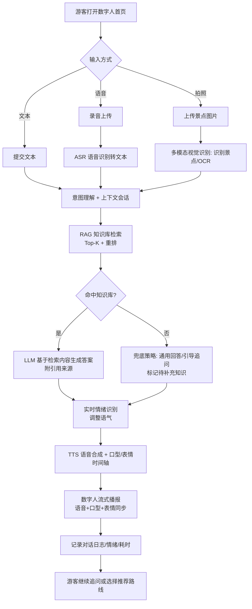
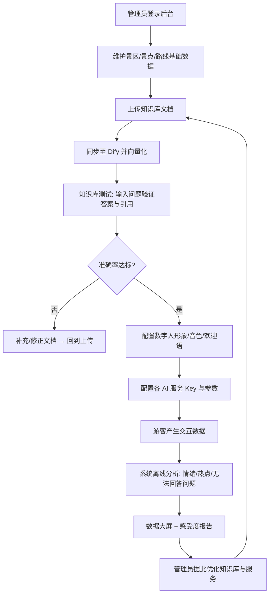

# 景区导览服务 AI 数字人系统 · 需求规格说明书

> **版本**：V2.0（竞赛工程基线）
>
> - **赛题**：第十五届"中国软件杯"大赛 A 组 · A5 - 景区导览服务 AI 数字人
> - **出题企业**：锐捷网络（苏州）有限公司
> - **文档定位**：本文档以《比赛规则原文》为**唯一裁定依据**，作为团队研发、测试、验收与文档撰写的**工程级基线**。
> - **编号约定**：`T-xx / A-xx / E-xx` 分别对应"游客端 / 管理端 / AI 引擎端"需求项，用于设计、开发、测试用例的双向追溯。

---

## 0. 确定技术口径

| 范围 | 确定口径 |
|---|---|
| 游客端 | UniApp App，交付 Android 安装包 |
| 管理后台 | Vue3 + Element Plus + ECharts |
| 后端 | Spring Boot |
| 数据库 | MySQL |
| 缓存 | Redis |
| 文件存储 | 本地文件存储 |
| 知识库 | 本地 RAG（MySQL `kb_chunk` 表 + `LocalRagService`，素材存放于 `assets/knowledge_raw/`，启动时自动导入） |
| 文本大模型 | 后端适配 `OpenAI-Compatible` 与 `Anthropic-Compatible` 两种协议格式，管理后台配置 `baseUrl`、`apiKey`、`modelName` |
| 多模态模型 | 后端适配 `OpenAI-Compatible` 与 `Anthropic-Compatible` 两种协议格式，用于图片识别、OCR、视觉问答 |
| ASR | 阿里云智能语音交互 ASR，语音转文字 |
| TTS | 阿里云智能语音交互 TTS，文字转语音 |
| 数字人 | 阿里云数字人服务，采用**实时/流式交互模式**（`streamUrl` 边合成边推流）；前端只接收并播放后端返回的地址。离线"文本转视频文件"模式因合成耗时长、不满足 <5s 延迟，不采用（详见 E-05、4.1） |
| 部署 | Nginx + Spring Boot Jar + MySQL |

---

## 1. 项目概述与目标

### 1.1 项目背景

国家推进文旅产业数字化转型，智慧景区建设成为趋势。传统景区导览存在四大痛点：**导游资源稀缺**（旺季供不应求）、**信息单向传递**（录音设备无法互动）、**缺乏情感连接**（冰冷设备无亲切感）、**管理盲区**（难以量化服务质量与获取真实反馈）。

本项目基于多模态大模型与 AI 数字人技术，构建一个 **7×24 小时在线的"智能导游"**：游客通过 App 与数字人进行语音、文本、视觉交互，获得个性化讲解与情感互动；同时为景区管理方提供数据看板与游客洞察，助力科学决策。

### 1.2 项目目标（对齐评分项，量化验收）

| 目标维度 | 具体目标 | 对应评分项（占比） |
|---|---|---|
| 功能完整 | 多模态交互、智能问答、个性化推荐、管理后台四大能力**全部稳定运行** | 功能完整度（40） |
| 数字人表现力 | 语音、表情、**口型同步**自然，形象贴合景区文化 | 数字人技术集成度与表现力（15） |
| 知识准确 | 景区事实性问答准确率 **≥90%**，答案支持溯源 | 大模型与知识库应用准确性（15） |
| 交互体验 | 语音问答端到端延迟 **<5s**，首响应体感 <2s（流式） | 行业实用与体验性（20） |
| 文档质量 | 设计文档、演示视频思路清晰，充分展示亮点 | 文档质量（10） |

### 1.3 范围边界

- **做**：游客交互端（UniApp App）、管理后台（PC Web）、后端业务编排、知识库问答、数字人联动、情绪分析、数据大屏。
- **范围外**：数字人底层建模驱动、ASR/TTS 算法训练、大模型训练、向量库底层研发。
- **强制基准数据**：`C-01` 官方"示范景区公开资料包"是知识库与测试集的唯一权威来源。

---

## 2. 核心角色与业务流程

### 2.1 角色定义

| 角色 | 说明 | 主要诉求 |
|---|---|---|
| 游客 | 游览景区的**注册用户**（手机号注册/登录，非匿名游客态） | 快速问答、听讲解、拿路线、被"看懂"、保存兴趣偏好与历史对话 |
| 景区管理员 | 后台运营人员 | 维护知识库、配置数字人、看数据、优化服务 |
| AI 引擎（系统内部服务集群） | 后端编排的一组 AI 代理 | 稳定、低延迟、支持溯源地返回结果 |

> 🧭 **角色澄清（重要修订）**：本项目的"游客"是**游览景区的注册用户**，需注册/登录后使用，**不是"免登录匿名访客"**。登录制带来两个价值：① 保存游客兴趣偏好，让个性化路线推荐（T-04）真正落地（匿名态每次都要重问偏好）；② 保存历史对话，游客可回看。游客端与管理端采用 Sa-Token 多账号体系隔离。

### 2.2 游客交互主流程（多模态问答）

### 2.3 管理员运营主流程

---

## 3. 详细功能需求

> 每个功能点均含**验收标准（AC）**，直接转化为测试用例。本章列出的需求全部纳入当前交付范围。

### 3.1 游客交互端（Tourist）

#### T-00 游客注册 / 登录 / 个人中心
- **描述**：游客是"游览景区的**注册用户**"，通过 App 手机号注册/登录后使用。登录态用于保存兴趣偏好与历史对话，支撑个性化推荐与体验连续性。
- **AC-1**：支持手机号 + 密码注册；密码 BCrypt 加密存储，任何接口不回传密码。
- **AC-2**：支持登录、登出；登录返回 Sa-Token 令牌（游客账号类型 `tourist`，与管理员令牌隔离）。
- **AC-3**：个人中心可查看/编辑昵称、头像、性别、兴趣标签；兴趣标签用于 T-04 个性化推荐的默认偏好。
- **AC-4**：可查看"历史对话"列表（按 `chat_session.tourist_user_id` 拉取），点击可回看该会话消息。
- **AC-5**：未登录状态下访问问答/语音/拍照等核心接口，返回 `401` 并引导登录。

#### T-01 多模态输入交互
- **描述**：支持文本输入、语音输入（录音）、图像输入（拍照识别）三种方式发起问答。
- **AC-1**：文本框输入并发送，能收到数字人语音+文字回答。
- **AC-2**：长按/点击录音，松开后自动 ASR 转写并触发问答；界面显示识别出的文字（便于纠错）。
- **AC-3**：调用摄像头/相册上传景点图片，系统返回该景点的识别结果与讲解。
- **AC-4**：三种输入方式在同一会话上下文中支持无缝切换。

#### T-02 数字人多模态输出（语音+表情+口型同步）
- **描述**：数字人以**语音、面部表情、口型同步**方式回答，是本赛题表现力核心（15 分）。
- **AC-1**：播报语音与口型动作在观感上同步，无明显错位（专家演示视频评估）。
- **AC-2**：回答内容的情绪（欢迎/致歉/讲解）与表情基调匹配。
- **AC-3**：支持流式播报，首帧/首音 **≤2s** 出现（避免长时间黑屏等待）。
- **接口约定**：后端统一调用阿里云数字人服务（**实时/流式交互模式**），向前端返回可边合成边播放的 `streamUrl`。前端只负责播放该地址，不实现 2D 自绘口型；口型与表情由数字人服务端合成，随视频流一并下发。

#### T-03 智能问答与讲解
- **描述**：准确回答景区历史、文化、景点特色等问题，并能对指定景点做讲解。
- **AC-1**：对官方资料包覆盖的问题，事实性回答准确率 **≥90%**（标准测试集）。
- **AC-2**：答案展示/朗读引用来源（命中的景点或文档），杜绝无依据编造。
- **AC-3**：对知识库外问题不"硬编"，给出礼貌兜底并引导（见 E-03）。

#### T-04 个性化路线推荐
- **描述**：根据游客兴趣（历史/自然/亲子/摄影等）推荐路线与讲解重点。
- **AC-1**：游客选择或用自然语言表达偏好（"我对历史感兴趣"），系统返回匹配的路线（含景点顺序、预计耗时、推荐理由）。
- **AC-2**：至少支持"经典/亲子/老人友好/历史文化/拍照打卡"等多种路线类型。
- **AC-3**：点击路线中的景点直接进入讲解。
- **AC-4**：登录游客的兴趣标签（`tourist_user.interest_tags`）作为默认偏好，无需每次重新表达即可获得个性化推荐；游客当次表达的偏好优先级高于历史标签。

#### T-05 实时情感互动
- **描述**：识别游客文本/语音中的情绪，调整回应语气（区别于后台离线分析）。
- **AC-1**：对明显消极表达（如"排队太久了太差了"）能以安抚性语气回应。
- **AC-2**：情绪标签随对话记录留存，供后台分析。

#### T-06 热门景点/推荐问题/反馈
- **AC-1**：首页展示热门景点、推荐问题（点击即问），降低使用门槛。
- **AC-2**：提供游客反馈入口（评分/文字），数据进入后台。

### 3.2 管理端（Admin）

#### A-01 管理员登录与鉴权
- **AC**：账号密码登录返回 Token；接口统一校验；密码加密存储（BCrypt）；支持退出与登录日志。

#### A-02 景区 / 景点 / 路线管理
- **AC-1**：景区、景点、路线均支持增删改查、分页、启停、图片上传。
- **AC-2**：景点配置标签、热门标记；路线配置景点顺序、适合人群、兴趣标签。
- **AC-3**：所有基础数据以官方示范景区资料包为初始内容。

#### A-03 知识库管理
- **描述**：上传/维护讲解词、文史资料、FAQ，底层固定对接 Dify。
- **AC-1**：支持 PDF/Word/TXT/Markdown/Excel/图片 上传，并展示解析、向量化、同步状态。
- **AC-2**：提供**知识库测试页**：输入问题→返回 AI 答案、命中文档、引用来源、响应耗时、是否命中。
- **AC-3**：支持对"无法回答问题"一键补充知识后重新验证（闭环）。

#### A-04 数字人配置
- **AC**：配置服务商、实例、音色、语速、欢迎语、形象；支持"测试播报"；记录调用成败日志。

#### A-05 AI 服务配置（含密钥安全）
- **AC-1**：支持配置文本大模型、多模态模型、Dify、阿里云 ASR、阿里云 TTS、阿里云数字人的服务地址、模型、Key、超时、重试等参数。
- **AC-1.1**：文本大模型与多模态模型必须支持 `OpenAI-Compatible`、`Anthropic-Compatible` 两种请求格式，配置项至少包括 `serviceType`、`protocol`、`baseUrl`、`apiKey`、`modelName`、`timeoutMs`、`enabled`。
- **AC-1.2**：多模态模型用于图片识别、OCR、景点识别与视觉问答；后台保存模型能力校验结果，未通过图片输入校验的配置不得启用。
- **AC-2 安全**：API Key **绝不明文返回前端**，列表脱敏，存储加密，日志不落完整密钥。

#### A-06 对话记录管理
- **AC**：按时间/关键词/输入方式/情绪/成败筛选；查看完整详情（含 ASR 文本、引用、耗时）；支持标记"待补充知识库"。

#### A-07 游客感受度分析报告
- **AC**：输出情绪分布、情绪趋势、热门问题 Top、热门景点 Top、无法回答问题清单、AI 生成运营整改措施。

#### A-08 数据大屏
- **AC-1**：展示今日服务人次、问答/语音/图像/播报次数、平均响应时间、知识库命中率、情绪分布与趋势、异常次数、热门 Top5。
- **AC-2**：数据来自 MySQL 统计接口；支持"演示数据/真实数据"切换；科技感视觉，适配 PC 大屏。

#### A-09 日志管理
- **AC**：登录/操作/问答/各 AI 调用/异常/耗时日志写库，支持分页与按服务类型、成败筛选，统计第三方耗时与失败次数。

### 3.3 AI 引擎端（Engine，后端编排的核心竞争力）

#### E-01 会话与上下文管理
- **AC**：以 `sessionId` 维护多轮上下文；支持指代消解（"它有多高"能对应上一句景点）；上下文长度与超时支持配置。

#### E-02 RAG 检索策略（保障 90% 准确率）
- **AC-1**：检索流程 = `Query 改写/补全 → 向量召回 Top-K(默认8) → 重排(rerank)取 Top-N(默认3) → 拼接上下文 → LLM 生成`。
- **AC-2**：设**相似度阈值**，低于阈值判定"未命中"，触发兜底而非强答。
- **AC-3**：Prompt 强约束"仅依据提供的资料回答，未提及则说明不确定"，并要求输出引用编号。
- **AC-4**：知识库分块（chunk）带元数据（所属景点/文档/来源），支持答案溯源。

#### E-03 兜底与防幻觉策略
- **AC**：未命中知识库时，返回统一话术（"这个问题我暂时没有权威资料…"）+ 引导追问 + 记录到"待补充问题"；严禁编造具体史实数据。

#### E-04 多模态视觉识别
- **AC**：接收景点图片，调用后台配置的多模态模型识别景点或 OCR 文字，映射到知识库对应景点后讲解。多模态模型通过 `OpenAI-Compatible` 或 `Anthropic-Compatible` 协议适配器接入。

#### E-05 数字人驱动与口型数据契约
- **AC-1**：数字人驱动能力由后端 `integration/avatar` 客户端统一封装阿里云数字人服务（实时/流式交互模式），**不单独对游客端暴露 REST 接口**。游客侧通过问答链路的 SSE `avatar` 事件下发 `streamUrl`（见接口契约 §3.3）；管理端通过 `/api/admin/avatar/test` 测试播报（见接口契约 §2.5）。前端播放 `streamUrl` 完成语音、表情和口型同步输出。
- **AC-2 前置验证（阻塞项）**：数字人功能开发前，必须用真实 API 完成技术验证并记录：① 确认所用产品为实时/流式交互模式而非离线视频生产模式；② 实测"发出文本→出第一帧/第一声"耗时，需满足首音 ≤2s；③ 确认音画同步无明显错位。验证未通过则阻塞数字人功能开发，转 R-01 备用方案。
- **AC-3 降级**：数字人服务超时或失败时，降级为"纯语音（`audioUrl`）+ 静态形象"，不阻断对话（见 R-06）。

#### E-06 定位与 GPS 弱信号处理
- **AC-1**：使用 GPS 定位推荐"附近景点"。
- **AC-2**：GPS 无法使用/漂移时，系统先使用"拍照识别景点"确定位置（复用 E-04）；图片识别无法使用时进入手动选择景点流程，保证核心讲解不中断。

#### E-07 实时情绪识别
- **AC**：对用户输入做情绪分类（积极/中性/消极/投诉风险），实时影响回应语气并落库。

#### E-08 全链路延迟控制（<5s）
- **AC**：见第 4 章性能预算；采用**流式输出**（ASR 边说边转、LLM 流式、TTS 分句合成），保证首响应体感 <2s。

---

## 4. 非功能性需求

### 4.1 性能：延迟预算（对齐"语音问答 <5s"）

本节定义语音问答端到端延迟的测量口径与预算拆解，并要求通过流式处理降低体感等待时间。

**测量口径**：从"游客松开录音按钮"到"数字人开始出声"为端到端延迟。

| 阶段 | 预算 | 优化手段 |
|---|---|---|
| ASR 语音转文本 | ≤1.0s | 流式识别，边说边转 |
| RAG 检索 + 重排 | ≤0.8s | 向量库本地化、Top-K 限制、结果缓存 |
| LLM 生成（首 token） | ≤1.0s | 流式输出，首句先出 |
| TTS 合成（首句） | ≤0.8s | 分句合成，首句即播 |
| 数字人驱动首帧 | ≤0.8s | 实时/流式数字人，预热实例 |
| **端到端合计** | **<5s（首音 <2s）** | 全链路流式 + 并行 |

> ⚠️ **前提约束**：本预算表中"数字人驱动首帧 ≤0.8s、首音 <2s"仅在数字人采用**实时/流式交互模式**时成立。若实测为离线视频生产模式（合成整段视频后返回 URL），本表不成立，须转 R-01 备用方案。该前提由 E-05 AC-2 强制验证。

- **NF-PERF-1**：语音问答端到端延迟 <5s（P95），首音 <2s。
- **NF-PERF-2**：文本问答首字 <1.5s。
- **NF-PERF-3**：常见问题（FAQ 命中）走缓存，<1s 返回。

### 4.2 稳定性

- **NF-S1**：连续演示 30 分钟不崩溃、无长时间无响应（规则明确要求"不应崩溃或长时间无响应"）。
- **NF-S2**：第三方 AI 服务超时/报错时执行失败处理流程（TTS 失败返回纯文本、数字人失败返回语音、知识库失败返回通用回答），并记录异常。
- **NF-S3**：所有外部调用设超时与重试上限，避免线程堆积。

### 4.3 安全

- **NF-SEC1**：所有网络暴露接口需鉴权——管理端与游客端均为 Sa-Token 登录态强校验（多账号体系隔离），游客端额外限流（防刷爆第三方 Key 产生费用）。
- **NF-SEC2**：第三方 API Key 仅存后端、加密落库，绝不下发前端，日志脱敏。
- **NF-SEC3**：上传文件校验类型与大小，防止恶意文件与目录穿越。
- **NF-SEC4**：LLM 输入输出做基础内容合规过滤，避免不当内容播报。
- **NF-SEC5**：游客端接口需限制请求频率、音频时长、图片体积和单会话调用次数，避免第三方服务额度被恶意消耗。

### 4.4 兼容性与并发

- **NF-C1**：游客端以 Android App 为本期交付形态，提交 Android 安装包。
- **NF-C2**：管理后台兼容 Chrome/Edge 最新版，数据大屏适配 1920×1080。
- **NF-C3**：演示级并发 ≥50 路会话不明显劣化（比赛非生产级，但需支撑评委同时体验）。

---

## 5. 关键技术约束与架构规定

### 5.1 强制约束（触碰即扣分/偏题）

| 编号 | 约束 | 依据 |
|---|---|---|
| C-01 | 知识库与标准测试集**必须**基于官方"示范景区公开资料包"构建 | 规则原文："参赛团队必须基于此资料进行开发与测试" |
| C-02 | 多模态大模型须作为**核心** AI 能力：主问答链路直接接入具备多模态能力的模型，且"拍照识别景点→讲解"作为演示主线显性功能，确保多模态能力可被评委直接感知，而非仅作 OCR 附属 | 规则非功能需求第 1 条（"至少 1 个多模态大模型作为核心 AI 能力支撑"） |
| C-03 | 必须构建**本地景区知识库**保障准确性 | 规则非功能需求第 2 条 |
| C-04 | 提交物齐全：源码、程序包、部署使用手册、总体设计文档、方案 PPT、≤7 分钟演示视频（.avi/.mp4/.wmv） | 规则"初赛作品提交要求" |

### 5.2 确定技术栈

| 层次 | 选型 | 说明 |
|---|---|---|
| 游客端 | UniApp App | 本期交付 Android 安装包；H5/小程序不作为本期范围 |
| 管理后台 | Vue3 + Element Plus + ECharts | 表格、表单和大屏场景更适合 PC Web |
| 后端 | Spring Boot（统一编排 AI 代理） | 作为 AI 编排中台，屏蔽第三方服务差异 |
| 缓存 | Redis | 用于 FAQ、会话、热点问题、统计缓存与限流 |
| 数据库 | MySQL | 存储业务数据、配置、日志和统计数据 |
| 文件存储 | 本地文件存储 | 存储知识库原始文件、图片、音频和数字人相关文件 |
| 知识库/RAG | Dify | 固定使用 Dify 管理知识库、检索和溯源 |
| 文本大模型 | 配置式协议适配器 | 支持 `OpenAI-Compatible`、`Anthropic-Compatible` 两种格式，配置 `baseUrl`、`apiKey`、`modelName` |
| 多模态模型 | 配置式协议适配器 | 支持 `OpenAI-Compatible`、`Anthropic-Compatible` 两种格式，用于图片识别/OCR/视觉问答 |
| ASR | 阿里云智能语音交互 ASR | ASR = Automatic Speech Recognition，语音转文字 |
| TTS | 阿里云智能语音交互 TTS | TTS = Text To Speech，文字转语音 |
| 数字人 | 阿里云数字人服务 | 固定使用阿里云数字人**实时/流式交互模式**，后端返回 `streamUrl`；离线视频生产模式不满足延迟要求，不作为主方案 |
| 部署 | Nginx + Spring Boot Jar + MySQL | 比赛阶段不上 Docker，降低部署门槛 |

### 5.3 架构规定

- **后端做"AI 编排中台"**：所有第三方 AI 通过后端代理调用，前端只跟自己后端通信——便于统一鉴权、限流、缓存、降级、日志与耗时统计，也保护密钥。
- **AI 模型配置做协议适配**：文本大模型和多模态模型不直接写死厂商 SDK，而是统一抽象为 `OpenAI-Compatible` 与 `Anthropic-Compatible` 两类请求格式，后端按配置动态选择适配器。
- **口型数据契约必须验证**（见 E-05 AC-2）：固定使用阿里云数字人服务，开发前必须用真实 API 验证——① 产品为实时/流式交互模式；② 首音 ≤2s；③ 音画同步无错位。验证未通过即阻塞数字人开发并转 R-01 备用方案。
- **流式贯穿全链路**：ASR/LLM/TTS 均用流式接口，是延迟达标的根本，不要等全部生成完再返回。

---

## 6. 风险与应对

本表用于设计评审和演示预案，要求每个高风险点都有明确处理路径。

| # | 风险 | 触发场景 | 处理措施 | 关联 |
|---|---|---|---|---|
| R-01 | **口型不同步/延迟超标**，数字人"读稿脸" | 阿里云数字人为离线视频生产模式，或返回视频音画不同步 | 开发前完成实时/流式模式与首音≤2s验证（E-05 AC-2）；验证不通过则阻塞数字人开发，备用方案：改用"音频 + 2D 形象口型时间轴"自绘方案，或降级为纯语音+静态形象 | E-05 / T-02 |
| R-02 | **延迟超 5s** | 串行调用、大模型慢、网络抖动 | 全链路流式；FAQ/热门问题走 Redis 缓存;并行化独立调用;首响应先出文字再补语音 | E-08 / 第4章 |
| R-03 | **准确率不足 90%** | 检索召回差、模型幻觉 | 强化 RAG（改写+重排+阈值）；Prompt 约束仅依据资料;未命中即兜底不硬答；用测试集反复调优 | E-02 / E-03 |
| R-04 | **模型幻觉编造史实** | 知识库无相关内容仍强答 | 相似度阈值 + 兜底话术 + 引用溯源，资料不足时说明"不确定" | E-03 |
| R-05 | **GPS 信号弱/无法定位** | 室内、山区、设备无 GPS | 先使用拍照识别定位；图片识别无法使用时进入手动选景点流程，讲解不中断 | E-06 |
| R-06 | **第三方 AI 服务超时/限流/欠费** | 演示当天云服务波动 | 超时重试 + 熔断处理（数字人失败→纯语音；语音失败→纯文本）；演示前预热并准备本地录屏兜底 | E-05 / A-05 |
| R-07 | **API Key 泄露** | 密钥硬编码或返回前端 | 后端集中托管、脱敏返回、加密存储、日志不落全密钥 | A-05 |
| R-08 | **网络暴露接口被刷** | 公网部署无防护 | 统一鉴权、游客态限流、图片/音频大小与频率限制 | 第4章安全 |
| R-09 | **演示环境不稳定** | 现场网络差、临时故障 | 准备"演示数据"开关（大屏/报告支持切换）、预置会话、离线录屏备份，保证 7 分钟视频万无一失 | A-08 |
| R-10 | **内容合规风险** | 用户诱导生成不当内容 | 输入输出内容审核，超范围话题礼貌拒答并拉回景区主题 | E-03 |

---

## 附录 A：需求-评分项追溯矩阵

> 用于自查"每一分怎么拿"，并放进设计文档，向评委证明覆盖度。

| 评分项（占比） | 覆盖需求项 |
|---|---|
| 功能完整度（40） | T-01~T-06、A-01~A-09、E-01、E-05 |
| 数字人集成度与表现力（15） | T-02、E-05、A-04、R-01 |
| 大模型与知识库准确性（15） | T-03、E-02、E-03、A-03、R-03/R-04 |
| 行业实用与体验性（20） | T-04、T-05、E-06、E-07、E-08、第4章、A-07 |
| 文档质量（10） | 本文档全篇 + 追溯矩阵 + 流程图 |

## 附录 B：核心接口清单

| 接口 | 用途 | 关键返回 |
|---|---|---|
| `POST /api/tourist/chat/text/stream` | 文本问答（SSE 流式） | 答案文本、引用来源、情绪标签、sessionNo |
| `POST /api/tourist/chat/voice/stream` | 语音问答（SSE 流式） | ASR文本、答案文本、引用来源、情绪标签、音频URL、数字人 `streamUrl`、sessionNo |
| `POST /api/tourist/vision/recognize` | 拍照识别景点 | 景点ID、识别置信度、讲解入口 |
| （内部）数字人播报 | 由后端编排调用，不单独暴露给前端 | `streamUrl`（实时/流式）；降级时返回 `audioUrl` + 静态形象标记 |
| `GET /api/tourist/route/recommend` | 路线推荐 | 路线列表（景点顺序、耗时、理由） |
| `GET /api/admin/dashboard/overview` | 数据大屏 | 各项统计指标 + 趋势序列 |
| `POST /api/admin/knowledge/test` | 知识库测试 | 答案、命中文档、引用、耗时、是否命中 |

> 📌 接口路径、入参、出参、鉴权以《接口契约说明书》为唯一权威；本清单仅为需求侧速览。游客端统一前缀 `/api/tourist/**`，管理端 `/api/admin/**`。

---

> **执行顺序**：① 拿到官方资料包后据此建知识库与测试集；② 完成阿里云数字人口型同步验证；③ 打通文本问答、语音问答、数字人播报、Dify 知识库主链路。
