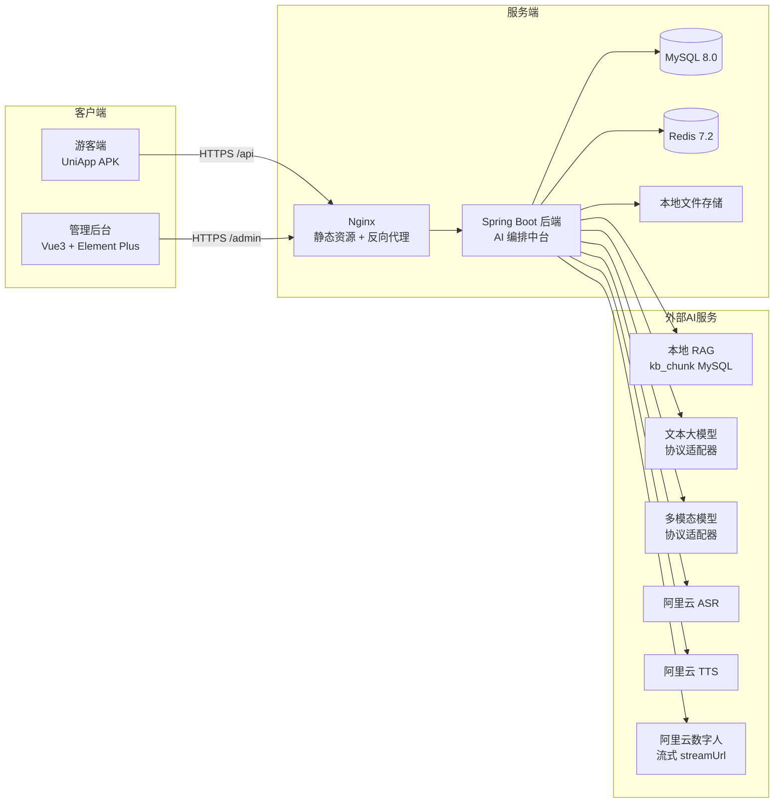

# 架构设计说明书

> **版本**：V1.0（架构基线，冻结版）
>
> - **赛题**：第十五届"中国软件杯"大赛 A 组 · A5 - 景区导览服务 AI 数字人
> - **上游依据**：`01_需求阶段/需求规格说明书.md`、`02_设计阶段/总体设计说明书.md`
> - **文档定位**：本文档是**架构的唯一裁定依据**。所有技术版本、分层结构、包名、目录名在此**逐级钉死**，执行方（Codex）**不得新增、删除、重命名、合并任何层级**。
> - **强制原则**：本文档不含"可选 / 建议 / 视情况 / 二选一"。凡出现选型，均为**唯一确定值**。执行方若发现文档未覆盖的情况，**必须停止并回问**，严禁自行发挥。

---

## 0. 全局版本锁定表（冻结，不可更改）

> ⛔ **红线**：本章同时区分两类版本口径：**工程目标版本锁定**与**本地执行工具链兼容口径**。
>
> - **工程目标版本锁定**：`pom.xml` / `package.json` 中的依赖版本、插件配置、Java 编译 `release/target` 必须与本表逐字一致。Codex 不得升级、降级或替换 Spring Boot、MyBatis-Plus、Sa-Token、Vue、Vite、TypeScript、Element Plus、pnpm 等锁定项。
> - **本地执行工具链兼容口径**：执行构建的本机 JDK / Maven / Node.js 不要求与历史冻结表逐字一致，但必须落在本章声明的兼容范围内，并且真实构建命令 exit code = 0。
> - **审计口径**：审计方不得仅因本机 Maven / Java / Node.js 实际版本不同直接判不通过；只要工程配置版本对齐、构建成功、执行方如实报告实际版本，即可作为有效证据。该口径不放松依赖版本、表结构、接口契约、后端五层、密钥红线。

### 0.1 后端版本锁定

| 组件 | 锁定版本 | 说明 |
|---|---|---|
| Java 编译目标 | 17（release/target） | `pom.xml` 中 Maven 编译 release/target 必须为 17；本地执行 JDK 允许 17 或 21 LTS |
| 构建工具 | Maven 3.9.x | 本地执行工具链兼容范围；不使用 Gradle |
| Spring Boot | 3.2.5 | 不使用 2.x，不使用 3.3+ |
| MyBatis-Plus | mybatis-plus-spring-boot3-starter 3.5.5 | 唯一 ORM，禁止裸 JPA/Hibernate |
| 数据库 | MySQL 8.0.36 | 字符集 utf8mb4 |
| 连接池 | HikariCP（Spring Boot 内置） | 不引入 Druid |
| 缓存 | Redis 7.2 | 客户端用 spring-boot-starter-data-redis |
| 鉴权 | Sa-Token 1.38.0 | 唯一鉴权框架，禁止自撸 JWT 拦截器 |
| 密码加密 | Spring Security Crypto 的 BCryptPasswordEncoder | 仅用其加密能力，不引入完整 Security |
| 接口文档 | Knife4j 4.5.0（knife4j-openapi3-jakarta-spring-boot-starter） | 唯一 API 文档工具 |
| 工具库 | Hutool 5.8.27 | 唯一通用工具库 |
| 简化代码 | Lombok 1.18.30 | 允许使用注解，禁止关闭 |
| JSON | Jackson（Spring Boot 内置） | 不引入 Fastjson/Gson |
| 参数校验 | spring-boot-starter-validation | 唯一校验方案 |

### 0.2 管理后台（admin-web）版本锁定

| 组件 | 锁定版本 | 说明 |
|---|---|---|
| Node.js | 20.x 或 22.x LTS | 本地执行工具链兼容范围；执行方必须如实报告实际版本 |
| 包管理器 | pnpm 8.15.4 | 锁定版本；不使用 npm/yarn 装依赖 |
| 构建工具 | Vite 5.2.0 | 唯一构建工具 |
| 框架 | Vue 3.4.21 | 组合式 API（`<script setup>`），禁止选项式 API |
| 语言 | TypeScript 5.4.5 | 全量 TS，禁止 `.js` 业务文件、禁止 `any` 兜底 |
| UI 组件库 | Element Plus 2.7.0 | 唯一组件库，禁止混用 Antd/Naive |
| 状态管理 | Pinia 2.1.7 | 唯一状态库，禁止 Vuex |
| 路由 | Vue Router 4.3.0 | 唯一路由库 |
| HTTP | Axios 1.6.8 | 唯一请求库，统一封装 |
| 图表 | ECharts 5.5.0 | 唯一图表库，数据大屏专用 |
| CSS 预处理 | SCSS（sass 1.72.0） | 唯一预处理器 |
| 代码规范 | ESLint 8.57.0 + Prettier 3.2.5 | 强制启用，提交前必过 |

### 0.3 游客端（tourist-app）版本锁定

| 组件 | 锁定版本 | 说明 |
|---|---|---|
| 框架 | UniApp（Vue3 语法） | 通过 HBuilderX 或 CLI 创建 |
| Vue | Vue 3.4.x（UniApp 内置版本） | 组合式 API |
| 语言 | TypeScript | 业务逻辑用 TS |
| 请求 | 统一封装 `uni.request` | 禁止散落裸调用 |
| 交付形态 | Android APK | 本期唯一交付形态，见需求 NF-C1 |
| 状态管理 | Pinia（UniApp 适配版） | 唯一状态库 |

### 0.4 外部 AI 服务锁定（对齐需求书第 0 章）

| 能力 | 锁定服务 | 接入方式 |
|---|---|---|
| 知识库/RAG | 本地 RAG | MySQL `kb_chunk` 表 + `LocalRagService`（余弦相似度 + 关键词降级）；素材存放于 `assets/knowledge_raw/`，启动时由 `KnowledgeInitRunner` 自动导入 |
| 文本大模型 | 配置式协议适配器（`OpenAI-Compatible` / `Anthropic-Compatible`） | 后端适配器，运行时读配置 |
| 多模态模型 | 配置式协议适配器（`OpenAI-Compatible` / `Anthropic-Compatible`） | 后端适配器，运行时读配置 |
| ASR 语音识别 | 阿里云智能语音交互 ASR | 后端 SDK/HTTP 封装 |
| TTS 语音合成 | 阿里云智能语音交互 TTS | 后端 SDK/HTTP 封装 |
| 数字人 | 阿里云数字人服务（**实时/流式交互模式**，返回 `streamUrl`） | 后端封装，前端只播放 |

> ⛔ **红线**：Codex 不得把任何 AI 服务的 API Key、baseUrl、模型名**硬编码**进代码。所有外部服务参数一律从数据库配置表 + 环境变量读取（见数据库设计 `ai_service_config` 表）。

---

## 1. 系统总体架构（三端 + 中台）



**铁律**：客户端**永远只与本系统后端通信**，绝不允许游客端/管理后台直接调用任何外部 AI 服务。所有外部调用都由 Spring Boot 后端代理，理由见需求书 5.3（统一鉴权、限流、缓存、降级、日志、密钥保护）。

---

## 2. 后端分层架构（治"没架构 / SQL 写 Controller"）

### 2.1 强制五层结构

> ⛔ **红线**：后端严格遵循下列**五层**，每层职责唯一，**上层只能调用下一层，禁止跨层调用、禁止反向依赖**。

```
Controller（控制层）→ Service（业务接口）→ ServiceImpl（业务实现）→ Mapper（数据访问）→ MySQL
```

| 层 | 唯一职责 | 明确禁止 |
|---|---|---|
| **Controller** | 接收 HTTP 请求、参数校验（`@Valid`）、调用 Service、返回统一 `Result<T>` | ⛔ 禁止写任何业务逻辑；⛔ 禁止出现 SQL；⛔ 禁止直接注入/调用 Mapper；⛔ 禁止调用外部 HTTP |
| **Service（接口）** | 定义业务方法签名 | ⛔ 禁止写实现 |
| **ServiceImpl** | 业务逻辑、事务（`@Transactional`）、编排 Mapper 与外部服务客户端 | ⛔ 禁止手写 SQL 字符串拼接；⛔ 禁止直接写 HTTP 调用（须走 `integration` 层客户端） |
| **Mapper** | 数据库 CRUD，继承 MyBatis-Plus `BaseMapper<T>` | ⛔ 禁止出现业务逻辑；复杂查询写在 XML，禁止 `${}` 拼接（防注入） |
| **外部服务集成（integration）** | 封装 Dify/大模型/ASR/TTS/数字人的 HTTP 客户端 | ⛔ 禁止被 Controller 直接调用；只能被 ServiceImpl 调用 |

### 2.2 请求处理链路（唯一标准路径）

```
HTTP → Controller.方法(@Valid DTO)
      → Service 接口
      → ServiceImpl（事务 + 业务）
          ├→ Mapper（读写 MySQL）
          ├→ Redis（缓存/限流）
          └→ integration 客户端（调外部 AI）
      → 返回 Entity/VO
      → Controller 包装成 Result<VO>
      → 全局异常处理器兜底
```

> ⛔ **红线（可被审计机器扫描）**：
> - Controller 类中出现 `select`/`insert`/`update`/`delete`（不分大小写）字样 = **违规**。
> - Controller 中出现 `@Autowired ... Mapper` 或 `RestTemplate`/`WebClient`/`HttpClient` = **违规**。
> - 单个 `.java` 文件超过 **400 行** = **违规**（须拆分）。
> - 单个方法超过 **80 行** = **违规**。

### 2.3 后端包结构（逐包钉死，不得增删改名）

> 根包固定为 `com.guido.scenicai`。Codex 必须严格按下列包树创建，**每个业务模块内部都重复 controller/service/service.impl/mapper/entity/dto/vo 七件套**，禁止把不同模块的类混在一个包里。

```
backend/
└── src/main/java/com/guido/scenicai/
    ├── ScenicAiApplication.java          # 启动类（唯一 main）
    ├── common/                           # 全局公共（跨模块复用）
    │   ├── result/                       # Result<T>、ResultCode 枚举、PageResult<T>
    │   ├── base/                         # BaseEntity（公共6字段）、BasePageQuery（分页入参基类）
    │   ├── exception/                    # 全局异常处理器 + 业务异常 BizException
    │   ├── config/                       # Redis/Knife4j/Sa-Token/Web/跨域/MyBatisPlus/异步线程池 配置类
    │   ├── interceptor/                  # 限流、日志、鉴权拦截器
    │   ├── security/                     # 凭证 AES 加解密工具、脱敏工具（apiKey/AccessKey）
    │   ├── constant/                     # 全局常量、枚举（ServiceType/InputType/Emotion/LogType 等）
    │   └── util/                         # 通用工具（仅放无业务的纯工具）
    ├── integration/                      # ⭐外部 AI 服务集成层（唯一对外出口）
    │   ├── common/                       # ⭐集成层公共：AiConfigLoader（按 service_type 读配置表并解密）、
    │   │                                 #   AbstractAiClient（超时/重试/降级模板）、AiCallLogHelper（统一落 sys_log）
    │   ├── llm/                          # 文本大模型协议适配器
    │   │   ├── LlmClient.java            #   统一接口
    │   │   ├── OpenAiCompatibleAdapter   #   OpenAI 协议实现
    │   │   └── AnthropicCompatibleAdapter#   Anthropic 协议实现
    │   ├── vlm/                          # 多模态模型协议适配器（同双协议）
    │   ├── embedding/                    # 向量化客户端（OpenAI-Compatible Embedding）
    │   └── aliyun/                       # 阿里云 ASR / TTS / 数字人客户端
    ├── job/                              # ⭐定时任务（@Scheduled）：每日统计快照 stat_daily、会话超时清理
    └── module/                           # ⭐业务模块（每个模块七件套齐全）
        ├── admin/                        # 管理员登录鉴权（StpAdminUtil）
        │   ├── controller/
        │   ├── service/  service/impl/
        │   ├── mapper/  entity/  dto/  vo/
        ├── tourist/                      # ⭐游客注册/登录/个人中心/历史会话（StpTouristUtil）
        ├── scenic/                       # 景区管理
        ├── spot/                         # 景点管理
        ├── route/                        # 路线管理与推荐（含 route_spot 顺序）
        ├── knowledge/                    # 知识库文档 + 同步 + 测试
        ├── chat/                         # 文本/语音/多轮会话编排 + SSE 流式
        ├── vision/                       # 拍照识别景点编排（调 integration.vlm）
        ├── avatar/                       # 数字人播报编排（调 integration.avatar）
        ├── sentiment/                    # 实时情绪识别 + 离线分析报告
        ├── dashboard/                    # 数据大屏统计 + 演示开关
        ├── aiconfig/                     # AI 服务配置（对应 ai_service_config 表）
        ├── log/                          # 各类日志查询
        └── file/                         # 文件上传/访问/校验
```

> ⛔ **红线**：`module` 下每个业务模块必须**自带** controller/service/service.impl/mapper/entity/dto/vo。禁止出现"所有 Controller 堆在一个 controller 包、所有实体堆在一个 entity 包"的扁平化写法。DTO（入参）、VO（出参）、Entity（表映射）三者**必须分开**，禁止用 Entity 直接接收请求或直接返回前端。
>
> 🧭 **为什么这样分（给外行的架构说明）**：
> - `admin` 与 `tourist` 拆成两个模块——管理员和游客是两条独立账号线（Sa-Token 多账号），职责、字段、鉴权都不同，绝不能混在一个 `auth` 里。
> - `integration/common` 是集成层的地基——所有外部 AI 客户端都继承 `AbstractAiClient`，超时/重试/降级/日志由模板统一处理，避免 Codex 在每个客户端里各写一套（必然写乱、写漏降级）。
> - `job` 独立——每日统计快照（数据大屏数据源）是定时任务，不能塞进某个 Controller。
> - `vision` 从 `chat` 拆出——拍照识别是独立业务入口，与文本/语音问答编排不同。

### 2.4 DTO / VO / Entity 三分强制说明

| 对象 | 用途 | 位置 | 红线 |
|---|---|---|---|
| **Entity** | 与数据库表一一对应（`@TableName`） | `module/xxx/entity/` | ⛔ 禁止出现在 Controller 方法签名里（既不做入参也不做出参） |
| **DTO** | 接收前端请求参数，带 `@NotNull`/`@Size` 等校验注解 | `module/xxx/dto/` | ⛔ 禁止包含数据库主键自增字段作为必填 |
| **VO** | 返回给前端的视图对象，**脱敏后**的数据 | `module/xxx/vo/` | ⛔ 敏感字段（密码、apiKey）禁止出现在任何 VO 中 |

---

## 3. 前端目录结构（治"上千行大文件 / 不分模块"）

### 3.1 管理后台 admin-web（逐目录钉死）

```
admin-web/
├── src/
│   ├── api/                    # 每个后端模块一个 .ts 文件（仅放请求函数）
│   │   ├── request.ts          # Axios 统一封装（拦截器、错误处理、token）
│   │   ├── login.ts  scenic.ts  spot.ts  route.ts  knowledge.ts
│   │   ├── avatar.ts  aiConfig.ts  chat.ts  dashboard.ts  log.ts  sentiment.ts
│   ├── views/                  # 每个业务一个目录，页面拆组件
│   │   ├── login/  dashboard/  scenic/  spot/  route/  knowledge/
│   │   ├── avatar/  ai-config/  chat-record/  sentiment/  screen/  log/
│   ├── components/             # 全局可复用组件
│   │   ├── PageTable/          # 通用分页表格
│   │   ├── SearchForm/         # 通用查询表单
│   │   ├── UploadFile/         # 通用上传
│   │   └── EChartsBox/         # 图表容器
│   ├── stores/                 # Pinia，每个域一个 store
│   ├── router/                 # 路由（按模块拆分）
│   ├── types/                  # TS 类型定义（与后端 VO/DTO 对应）
│   ├── utils/                  # 纯工具
│   ├── styles/                 # 全局 SCSS 变量、主题
│   └── layout/                 # 布局骨架（侧边栏、顶栏）
```

> ⛔ **红线（可被审计机器扫描）**：
> - 单个 `.vue` 文件超过 **400 行** = **违规**（必须拆子组件）。
> - `views` 里的页面文件直接写 `axios.get(...)` = **违规**（请求必须走 `api/` 层）。
> - 出现 `any` 类型且无 `// eslint-disable` 合理说明 = **违规**。
> - 一个 `.vue` 里塞多个不相关业务面板不拆分 = **违规**。

### 3.2 游客端 tourist-app（逐目录钉死）

```
tourist-app/
├── pages/                      # 每个页面一个目录（一屏一目录，禁止塞在一个巨型页面里）
│   ├── login/                  # 游客登录（手机号 + 密码）★ 登录制
│   ├── register/               # 游客注册（手机号 + 密码 + 昵称）★ 登录制
│   ├── index/                  # 数字人首页（欢迎语 + 热门景点 + 推荐问题）
│   ├── chat/                   # 文本/语音问答（SSE 流式）
│   ├── vision/                 # 拍照识别
│   ├── route/                  # 路线推荐
│   ├── spot/                   # 景点详情
│   ├── history/                # 历史对话（按 tourist_user 拉取会话列表）★ 登录制
│   ├── profile/                # 个人中心（昵称/头像/兴趣偏好设置）★ 登录制
│   └── feedback/               # 反馈
├── components/                 # 复用组件（禁止把逻辑堆进页面）
│   ├── AvatarBox/              # 数字人播放器（播 streamUrl，含降级静态形象）
│   ├── VoiceButton/            # 录音按钮
│   ├── ChatBubble/             # 对话气泡
│   ├── SpotCard/               # 景点卡片
│   └── RouteCard/              # 路线卡片
├── api/                        # 请求封装（每域一个文件：auth/chat/vision/route/scenic/user）
├── stores/                     # Pinia（user 登录态、chat 会话态）
├── router/                     # 页面路由与登录守卫（未登录跳 login）
├── utils/                      # request.ts（统一请求+token注入）/ auth.ts（登录态）/ sse.ts（流式解析）/ 纯工具
├── static/                     # 静态资源
└── types/                      # TS 类型（与后端 VO/DTO 对应）
```

> ⛔ **红线**：
> - 游客端所有网络请求必须经 `utils/request.ts` 统一封装并自动注入登录 token，禁止在页面里散落裸 `uni.request`。
> - 单页面 `.vue`/`.nvue` 超 **400 行**须拆组件。
> - ⭐ 游客端为**登录制**（游客=注册用户）：除 `login`/`register` 外所有页面均需登录态；未登录访问受保护页面必须跳转登录页。SSE 流式解析统一放 `utils/sse.ts`，禁止在页面内手写流解析。

---

## 4. 命名规范（消除歧义，审计可核对）

| 对象 | 规则 | 正例 | 反例 |
|---|---|---|---|
| Java 类 | 大驼峰 | `SpotController`、`SpotServiceImpl` | `spot_controller` |
| Java 方法/变量 | 小驼峰 | `getSpotById` | `get_spot` |
| 数据库表 | 小写下划线，**无前缀**（以《数据库设计说明书》§0.4 表名为准） | `spot`、`chat_message`、`ai_service_config` | `t_spot`、`Spot`、`spotTable` |
| 数据库字段 | 小写下划线 | `create_time`、`scenic_id` | `createTime`（库里） |
| Vue 组件文件 | 大驼峰 | `SpotCard.vue` | `spotcard.vue` |
| 前端 api 文件 | 小驼峰域名 | `aiConfig.ts` | `AIconfig.ts` |
| 接口路径 | 小写中划线/复数 | `/api/tourist/chat/voice`、`/api/admin/spots` | `/api/getSpot` |
| 常量 | 全大写下划线 | `MAX_UPLOAD_SIZE` | `maxSize` |

> ⛔ **红线**：数据库层用 `snake_case`，Java 实体用 `camelCase`，靠 MyBatis-Plus 的 `map-underscore-to-camel-case=true` 自动映射，**禁止在实体上到处手写 `@TableField` 去救混乱命名**。

---

## 5. 统一返回与异常（全系统唯一格式）

### 5.1 统一响应体 `Result<T>`

```json
{ "code": 200, "message": "success", "data": {}, "timestamp": 1720000000000 }
```

| 字段 | 类型 | 说明 |
|---|---|---|
| code | int | 200 成功；4xx 客户端错误；5xx 服务端错误；业务码见 ResultCode 枚举 |
| message | string | 提示信息，失败时给人类可读原因 |
| data | T | 业务数据，失败时为 null |
| timestamp | long | 服务器毫秒时间戳 |

> ⛔ **红线**：所有 Controller **必须**返回 `Result<T>`，禁止直接返回裸对象、裸 String、裸 List。分页统一返回 `Result<PageVO<T>>`。

### 5.2 全局异常处理

- 唯一 `@RestControllerAdvice` 全局异常处理器，捕获 `BizException`、参数校验异常、系统异常，统一转 `Result`。
- ⛔ **红线**：禁止在 Controller/Service 里 `try{}catch(Exception e){ 吞掉 }` 后返回 null 或假成功——这是 Codex "假装完成"的典型手法，审计重点扫描。业务失败必须抛 `BizException`，由全局处理器返回明确错误码。

---

## 6. AI 编排中台的降级链（架构级强制）

> 对齐需求 R-06、NF-S2。每个外部 AI 调用**必须**在 `integration` 层实现超时 + 失败降级，降级路径唯一确定：

| 外部服务失败 | 唯一降级动作 | 落库 |
|---|---|---|
| 数字人（streamUrl）失败/超时 | 返回 `audioUrl` + 静态形象标记，前端播纯语音 | 记 `ai_call_log`，标记 degrade |
| TTS 失败/超时 | 返回纯文本答案，前端只显示文字气泡 | 同上 |
| ASR 失败/超时 | 提示"没听清，请重试或改用文字"，不崩 | 同上 |
| 大模型失败/超时 | 返回统一兜底话术，标记 `llm_failed` | 同上 |
| 本地知识库检索未命中 | 走大模型通用回答 + 标注"未使用知识库"（`hit_kb=0`，`need_supplement=1`） | 同上 |

> ⛔ **红线**：外部服务超时时间统一从 `ai_service_config.timeout_ms` 读取，禁止硬编码。任一外部服务异常**禁止**导致整个请求 500 崩溃——必须降级返回可用结果（需求 NF-S2）。

---

## 7. 架构红线汇总（本文档最高优先级，审计逐条核对）

1. 五层不可破：Controller→Service→ServiceImpl→Mapper→DB，integration 只被 ServiceImpl 调。
2. SQL 只出现在 Mapper/XML，Controller/Service 出现 SQL = 违规。
3. DTO/VO/Entity 三分，Entity 不进 Controller 签名，敏感字段不进 VO。
4. 单文件 ≤400 行，单方法 ≤80 行（前后端同标准）。
5. 所有 Controller 返回 `Result<T>`，全局异常统一处理，禁止吞异常返回假成功。
6. 外部 AI 只走 integration 层，客户端只连本系统后端。
7. API Key/baseUrl/模型名/超时**全部**来自配置表+环境变量，零硬编码。
8. 工程依赖版本与 Java 编译目标严格锁定第 0 章，禁止擅自升降级；本地 JDK/Maven/Node.js 按第 0 章兼容口径审计。
9. 前端请求走 api 层，禁止页面内裸请求；禁止 `any` 兜底。
10. 数字人固定"实时/流式 streamUrl"路线，无第二方案（备用方案仅在需求 R-01 验证失败时由人类决策启用，Codex 无权切换）。
