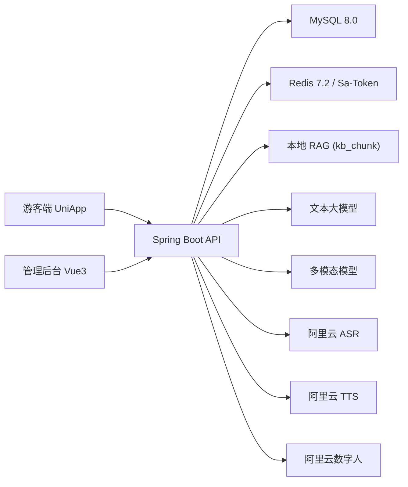
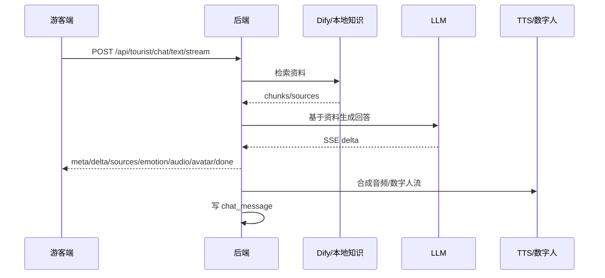
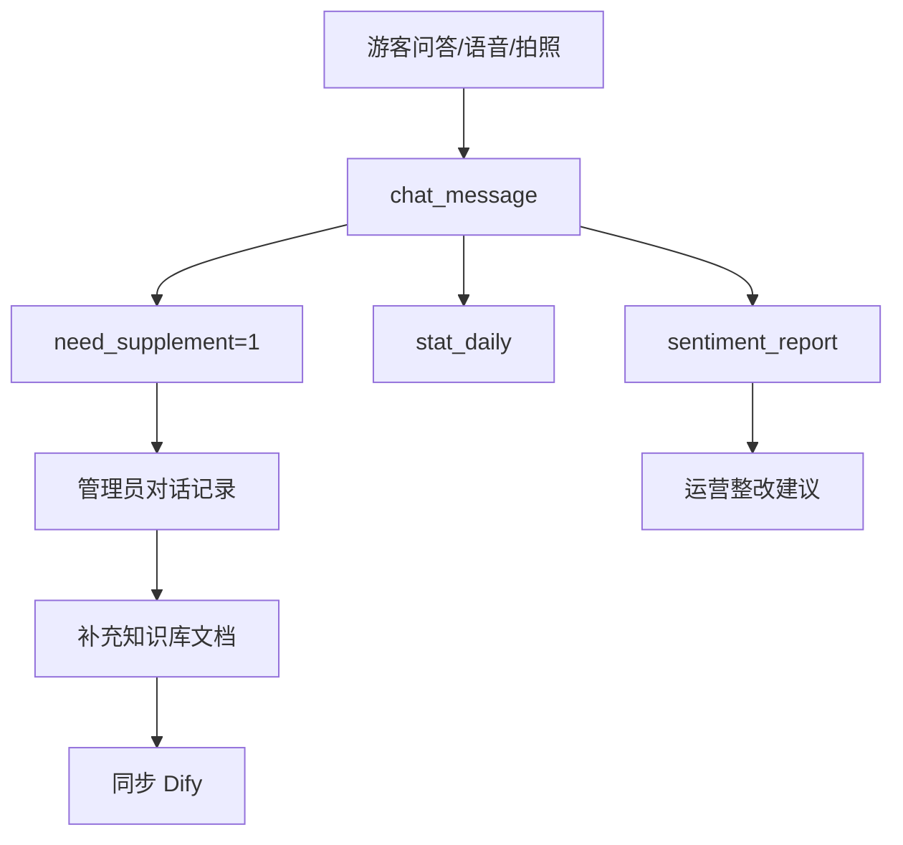

# 总体设计补充说明

> 本文件是交付阶段的实现侧补充说明，冻结基线仍以 `docs/02_设计阶段/总体设计说明书.md`、`docs/03_架构设计/架构设计说明书.md`、`docs/04_数据与接口` 为准。

## 1. 系统目标

系统面向景区导览服务场景，为注册游客提供文本、语音、拍照识别、数字人播报、路线推荐和反馈闭环，为管理员提供基础数据维护、知识库运营、AI 配置、对话审查、感受度分析和数据大屏。

## 2. 总体架构



## 3. 后端分层

后端严格采用五层结构：

```text
Controller -> Service -> ServiceImpl -> Mapper -> Database
```

约束：

- Controller 只做鉴权、参数接收和返回包装，不写 SQL，不直调 Mapper，不调外部 HTTP。
- 外部 AI 调用统一放在 `integration/**`。
- Entity / DTO / VO 分离，接口不直接返回 Entity。
- API Key、AccessKey、密码不硬编码，统一来自环境变量或加密后的配置表。

## 4. 核心业务链路

### 4.1 文本问答



### 4.2 语音问答

语音链路为 `ASR -> 知识库检索 -> LLM 流式回答 -> TTS -> 数字人`，`done` 事件携带 `asrMs/retrieveMs/llmMs/ttsMs/avatarMs` 延迟埋点。

### 4.3 拍照识别

游客上传图片后，后端保存图片、调用 VLM 识别景点文本，再映射本地 `spot` 和知识库资料。识别成功返回 `recognizedSpot.spotId/spotName/confidence`、讲解、音频和数字人流；识别失败返回引导话术。

### 4.4 个性化路线

游客输入自然语言偏好时，后端抽取“历史/自然/亲子/摄影/老人/经典/深度”等关键词，并结合 `route.interest_tags`、`suit_crowd`、路线名称、简介和类型排序。未输入偏好时读取 `tourist_user.interest_tags`。

### 4.5 情绪互动

系统对用户输入做实时情绪分类：`POSITIVE/NEUTRAL/NEGATIVE/COMPLAINT`。消极或投诉风险输入会触发安抚前缀，并将情绪写入 `chat_message.emotion`，供后台大屏和感受度报告统计。

## 5. 运营闭环



## 6. 数据统计与演示保障

- `stat_daily`：每日快照，支撑数据大屏和近 7 日趋势。
- `sentiment_report`：离线报告，汇总情绪、热点、未回答问题和运营建议。
- `demo_switch`：演示数据开关。`DASHBOARD_DEMO` 控制大屏，`REPORT_DEMO` 控制感受度报告。
- GPS 弱信号降级：GPS 定位失败后切拍照定位，拍照仍失败则手动选景点，保证导览主流程不中断。

## 7. 安全设计

- 管理员和游客采用 Sa-Token 多账号体系隔离。
- 管理端接口统一 `/api/admin/**`，游客端接口统一 `/api/tourist/**`。
- AI 密钥入库前 AES-GCM 加密，列表只返回脱敏值。
- 日志摘要通过脱敏工具处理，不记录完整密钥、Token 或密码。
- 登录失败不区分账号不存在和密码错误，降低枚举风险。

## 8. 当前待实测风险

| 风险 | 当前处理 |
|---|---|
| 阿里云数字人是否返回可播放 `streamUrl` | 客户端只接受真实可播放流地址；若只返回 WebSocket/Token，不冒充成功 |
| Dify 真实知识库召回 | 客户端已实现上传、检索、删除；等待真实 Dify 参数和资料包跑验收 |
| ASR/TTS 真实延迟 | 客户端已接入 REST 调用和耗时埋点；等待真实账号和音频样本 |
| 游客端 APK | 工程已成型；需 HBuilderX 真机或模拟器构建验收 |

